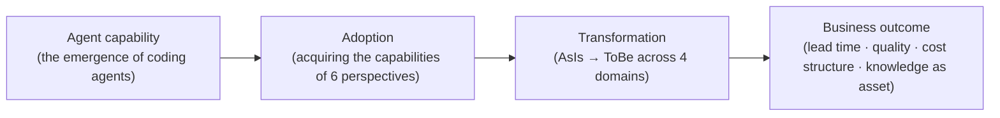
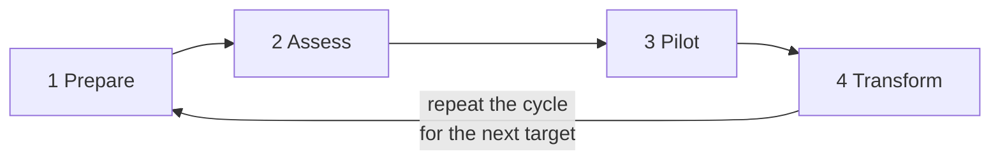

# Vibe Adoption Framework (VAF)

Roboco's framework for adopting Vibe Coding in established enterprises

## 1. Executive Summary

The Vibe Adoption Framework (VAF) structures the journey an established enterprise takes to shift software development toward an agent-centric model. Drawing on the experience and best practices Roboco has accumulated across Vibe Coding and AX (AI Transformation) consulting engagements with a range of companies, it presents a single system for what an organization must prepare (capabilities), where it changes (transformation domains), and in what order it should advance (the adoption journey).

Vibe Coding is a development approach in which humans state intent and AI agents write the code. The reason to examine this shift now is clear. Coding agents have already reached a level where they can take over a substantial share of the work skilled developers used to perform, and the gap keeps widening. A company that integrates agents into its development system reaps an effect equivalent to securing high-caliber development talent at low cost and at scale, whereas a company stuck at the level of individual experimentation uses the tools yet fails to convert them into organization-level results. What makes the difference is not the tool but the **system of adoption**.

An organization that adopts Vibe Coding systematically can expect the following outcomes.

- **Shorter lead time**: The time it takes for an idea to become working software shrinks. Feature development, bug fixes, and legacy analysis proceed in parallel and continuously.
- **Consistent quality**: Reviews and verification that once fluctuated with a person's condition and skill move into an automated harness, where they are enforced consistently.
- **A changed cost structure of development**: The ceiling on development capacity that once scaled with headcount is relaxed, and the range of systems the same team can handle widens.
- **Knowledge as an asset**: The tacit knowledge held in people's heads is converted into a documented knowledge base that agents draw on continuously, reducing dependence on any single individual.

VAF is built on three axes. First, it defines the capabilities an organization must possess as six **perspectives** and their constituent **capabilities**. Second, it identifies the four **transformation domains** where change actually occurs. Third, it presents a four-phase iterative **adoption journey** that executes the adoption. This document is written for both executives and IT leaders, and it names the primary stakeholders for each perspective. It is stated as generalized principles so that it applies regardless of an organization's size or industry, with concrete tool examples added where helpful.

## 2. Foundational Premise and Guiding Principles

### 2.1 Foundational Premise: Vibe Coding Is Software Development

The foundational premise of VAF is this. **Vibe Coding is no different from people developing software.** Vibe Coding shares exactly the same best practices and anti-patterns as conventional software development. Clear requirements, good architecture, code review, testing, documentation, incremental improvement — the principles that made human development succeed also make agent development succeed. Conversely, the factors that made people fail — ambiguous requirements, neglected legacy, deployment without verification — make agents fail in exactly the same way.

What changes is not the principles but the **economics**. Work that once demanded large amounts of time, money, and specialized talent — meticulous code review, thorough testing, detailed documentation, whole-legacy analysis — can now be performed by agents at low cost and on a continuous basis. Adopting Vibe Coding is therefore not a matter of learning an unfamiliar new methodology, but of finally realizing the good development culture you already knew, using agents as the lever. This recognition runs through the entire adoption strategy. An organization should not ask "what must we change for AI," but "how do we finally realize, together with agents, what we should have been doing all along."

### 2.2 Guiding Principles

The following three principles are design principles reflected in every perspective and every phase of the journey in VAF.

#### Principle 1: Agents Are Talent Leverage

The essence of agent adoption is obtaining an effect equivalent to hiring high-caliber talent cheaply and at scale. Adopting this view makes many decisions clear. What must you do for a capable developer who has just joined? Grant access, explain the system, teach the organization's rules, assign work, and review the results. An agent needs exactly the same things — a channel of access to the system, documented knowledge, codified rules, clear task instructions, and a verification system. When an agent fails to deliver, it is usually the same situation as "handing work to a new hire with no handover." Organizations that fail at adoption blame the agent; organizations that succeed build an onboarding system.

#### Principle 2: Agents Write the Code; Humans Keep Ownership

In an organization where Vibe Coding adoption is complete, people do not write code by hand. Agents write all of it. But **humans own it.** Every piece of code and every system must have a person who is accountable for it, and that person must be ready to answer whenever anyone asks. This principle is a declaration that "an agent made it, so I don't know" will not be tolerated in the organization. The author may change, but the duty to explain does not move. The success or failure of adoption should therefore be judged not by how fast code is produced, but by how far production speed is raised while people retain understanding and control.

#### Principle 3: Cognitive Debt Is to Be Managed, Not Eliminated

As the amount of code people did not write themselves grows, a gap opens between people's understanding of the system and the system as it actually is. This is **cognitive debt**. If technical debt is "design quality deferred to be paid off later," cognitive debt is "system understanding deferred to be gained later." And like technical debt, cognitive debt is not something that can be eliminated but something to be managed by weighing trade-offs. If everyone tries to fully understand all the code, the speed advantage agents provide disappears; if understanding is abandoned entirely, the ownership principle collapses. The organization must explicitly decide where to maintain deep understanding and where to allow summarized understanding, and reassess that decision periodically. It must be the organization, not the individual, that decides the level at which cognitive debt is managed.

### 2.3 Named Core Concepts

Alongside the guiding principles, we define two core concepts used throughout VAF.

#### Harness Engineering

Harness Engineering is the engineering discipline of systematizing the reviews people used to perform and the guardrails people used to build so that AI performs them instead. Code review, coding-convention checks, security inspection, test enforcement, pre-deployment verification — the quality control traditionally handled by senior developers' time and the organization's processes — is implemented as a combination of rules files, automated review, hooks, and verification pipelines. A harness is both a filter that screens an agent's output and a safeguard that lets the agent work freely within the organization's standards. A well-built harness does not merely reduce the human review burden; it raises human review to a **higher level of abstraction** (intent, design, trade-offs).

#### The Distinction Between Preference and Non-preference

An organization's development rules fall into two classes. **Non-preferences** are the things that are not up for negotiation — security policy, guardrails of all kinds, coding conventions, and so on. Non-preferences must all be managed together with the repository and must be enforceable on every member of the organization and every agent. **Preferences** are the extremely limited domain where individual discretion is allowed — a few things that do not affect the quality of the result, such as the level of detail in documentation. This distinction matters because in the age of agents, rules are embedded not in documents but in the execution environment. For people, a rule was a recommendation that could be broken; but a rule embedded in the repository becomes, for an agent, an environment that cannot be broken. The organization must explicitly decide what is a non-preference, and embed whatever it decides in the repository without exception. Leaving the preference domain wide open is not consideration; it is neglect of quality variance.

## 3. Framework Structure and Value Chain

### 3.1 The Three Axes

VAF is composed of three axes, each answering a different question.

- **Perspective & Capability** — *"What must the organization possess?"* It classifies the organizational capabilities needed for adoption into six perspectives, and defines concrete capabilities under each perspective. A capability is the unit of assessment and the unit of the improvement plan.
- **Transformation Domain** — *"What actually changes?"* It identifies the four domains where transformation occurs through Vibe Coding adoption, and defines the AsIs and ToBe of each domain.
- **Adoption Journey** — *"In what order do we proceed?"* It executes adoption as a four-phase iterative cycle: Prepare → Assess → Pilot → Transform.

The three axes relate to one another as follows. The organization advances along the **journey**, acquiring at each phase the **capabilities** it needs, and using those capabilities to turn the AsIs of each **transformation domain** into its ToBe.

### 3.2 Value Chain: From Capability to Outcome

VAF sees the path from Vibe Coding adoption to business results as a single value chain. The mere emergence of a new capability — agents — does not produce results on its own. The organization acquires the capabilities of the six perspectives and **adopts** agents; that adoption drives **transformation** across the four domains; and only as transformation accumulates does it become a **business outcome**.

This value chain helps you avoid two traps common in adoption discussions. First, the trap of mistaking tool adoption for a result — buying agent licenses is only the first link in the chain. Second, the trap of demanding results immediately — measuring outcomes without transformation leads to the mistaken conclusion that "we used AI and nothing changed." Executives should ask which link in this chain is the current bottleneck. That is the investment priority.

### 3.3 A Note on the Relationship Between Axes

**Knowledge appears on two axes.** Knowledge as a perspective (the knowledge base) addresses "the organizational capability to supply knowledge to agents," while knowledge as a transformation domain addresses "the transformation in which the way knowledge itself is managed shifts from tacit knowledge to a documented asset." The former is something to be acquired; the latter is something that changes. This is not accidental duplication but a reflection of the fact that in Vibe Coding adoption, knowledge is both a means and an object.

## 4. Transformation Domain

Transformation through Vibe Coding adoption occurs in four places. For each domain we define the AsIs (before adoption) and the ToBe (after adoption), and indicate the perspective that underpins the transformation. The pace of transformation differs by organization, but the direction is the same. Gauging where your organization stands in each domain is the starting point of assessment.

### 4.1 Code Production (Code)

**AsIs**: People write the code. Development capacity scales with the number and skill of developers, and hiring is capacity planning.

**ToBe**: Agents write the code, and people direct the intent and approve the results. The human role shifts from "how do we implement this" to "what do we build and why."

This transformation is the most visible, but it does not complete on its own. Unless the environment agents can access (Agent Environment), the knowledge they reference (Knowledge), and the rules they must follow (Governance & Guardrails) are in place, the transformation of code production will not rise above the level of individual experimentation. The expected outcomes are shorter lead time and expanded development capacity.

### 4.2 Quality Assurance (Quality)

**AsIs**: People review and verify manually. Quality depends on the reviewer's skill and available time, and it is the first thing sacrificed when schedule pressure mounts.

**ToBe**: The harness performs review and guardrails automatically. Coding conventions, security, and tests are embedded in the repository and enforced without exception, while human review concentrates on intent and design judgment.

The core of this transformation is that the locus of quality control moves from human discipline to the execution environment. The Harness Engineering perspective underpins it directly, and the preference/non-preference distinction (Governance & Guardrails) determines what gets embedded in the harness. The expected outcomes are consistent quality and the removal of the review bottleneck.

### 4.3 Knowledge (Knowledge)

**AsIs**: Knowledge of the system lives in people's heads and in oral transmission. Documents are accurate only when written, and departures and transfers mean knowledge loss.

**ToBe**: A documented knowledge base that agents draw on continuously becomes the organization's official memory. Because agents perform the documentation, its cost drops sharply, and the knowledge base is updated together with the code.

Documentation failed in the past not because it lacked value but because it was expensive. Agents change this cost structure. This transformation is underpinned directly by the Knowledge perspective, and it is also the material foundation of the cognitive-debt management principle — the cost of maintaining understanding must fall for the ownership principle to be sustainable. The expected outcomes are the removal of dependence on specific individuals and the acceleration of onboarding (for both people and agents).

### 4.4 Organization and Roles (Organization)

**AsIs**: An author-centric team. A developer's identity and evaluation are tied to "how well and how much code they write."

**ToBe**: An owner- and orchestrator-centric team. Members direct the work of multiple agents, hold ownership of the output, and are evaluated as people who can answer for the system at any time.

This is the slowest and hardest of the four transformations. Tools can be changed, but identity and evaluation systems resist. The People & Ownership perspective underpins it directly, and the Strategy perspective determines the rationale and pace of the transformation. An adoption that does not address this transformation explicitly ends up in the state of "we bought the tools but no one uses them." The expected outcomes are an organization that handles a wider range of systems with the same headcount, and an organization in which the risk of knowledge loss is managed.

## 5. Perspective and Capability

We define the capabilities an organization must possess to adopt Vibe Coding, divided into six perspectives. The first three perspectives (Strategy, People & Ownership, Governance & Guardrails) are the **people-and-organization perspectives**, addressing the direction, rules, and human change of adoption. The last three perspectives (Agent Environment, Knowledge, Harness Engineering) are the **technical perspectives for agents**, addressing the conditions under which agents can actually work.

Each perspective consists of a core question, primary stakeholders, and its capabilities. A capability is the unit of assessment (where are we lacking) and of planning (what do we build first). Do not try to acquire every capability perfectly before you begin. The correct approach is to mature the capabilities you need incrementally as you iterate through the adoption journey (Section 6).

### 5.1 Strategy

**Core question**: Why adopt, and what do we gain? | **Stakeholders**: Executives, business owners

Vibe Coding adoption is not a technology project but a transformation of the development system. Setting the direction, the investment, and the evaluation criteria is a matter for management, and if this perspective is weak, the efforts of the other five perspectives scatter into results at the level of individual heroics.

#### Adoption Strategy

The capability to codify why the organization adopts Vibe Coding and its target state. Document the purpose of adoption (is it cost, speed, quality, or mitigating talent risk) together with its priorities, and explicitly designate an executive sponsor. Do not mistake the "just buy the tools and hand them out" approach for a strategy — it is only the first link in the value chain (3.2). Expected outcome: an agreed direction that serves as the decision criterion throughout the entire adoption period. **Anti-pattern**: purposeless tool distribution. Six months later, momentum is spent, accompanied by a report that "utilization is low."

#### Value Measurement

The capability to define and track the effect of adoption through measurable metrics. Measure existing development-performance metrics — lead time, deployment frequency, defect rate, review turnaround time — as a baseline first, before you begin adoption. Agent usage (tokens, session count) is a cost metric, not a performance metric — always measure performance with software-delivery metrics. Expected outcome: an organization that answers "what improved with AI" with data. **Anti-pattern**: starting without a baseline, failing to prove results, and having the adoption itself founder at budget-renewal time.

#### SDLC Gap Analysis

The capability to set the ideal software development lifecycle (SDLC) for the business as the ToBe and to lay out the gap against the current way of developing (AsIs). Draw the ToBe not as "the current way with agents inserted into it" but as "a design redone on the premise of agents." Describe the gaps in the language of per-perspective capabilities, so that each gap connects to an improvement plan. Expected outcome: a gap list that forms the backbone of the adoption roadmap. **Anti-pattern**: drawing only the ToBe without analyzing the AsIs. If the organization does not know where it currently stands, the roadmap becomes wishful thinking.

#### Portfolio Prioritization

The capability to decide which projects and repositories to transform first. Select a pilot where success would have broad impact, where failure would cause limited business damage, and where the participating team has the will. Decide the order of transformation by learning value and diffusion effect, not by technical difficulty. Expected outcome: a well-grounded order of transformation, and a portfolio that is updated according to pilot results. **Anti-pattern**: starting with the hardest legacy first. An early failure hardens into the organizational narrative that "this doesn't fit our company."

### 5.2 People & Ownership

**Core question**: What is the role of people? | **Stakeholders**: Executives, team leads, HR

In an organization where agents write the code, a person's value is defined not by what they wrote but by what they are accountable for. This perspective implements Guiding Principles 2 (ownership) and 3 (cognitive debt) as organizational institutions.

#### Ownership System

The capability to designate an accountable person for every piece of code and every system, and to keep that person in "a state where they can answer at any time, whoever asks." Define the unit of ownership (repository, service, domain) and record the owner list in the repository. Along with the duty to answer, give owners the time and tools (the knowledge base, code exploration through agents) to stay in a state where they can answer. Expected outcome: an organization where the accountability to explain persists even as the author changes. **Anti-pattern**: declaring ownership but not funding its upkeep — the owner becomes an approver in name only.

#### Cognitive Debt Management

The capability to explicitly manage the gap between people's understanding of the system and the system as it actually is. Have the organization decide and document the level of understanding required per system (deep understanding for the core domain, summarized understanding for the periphery). In pilots and retrospectives, regularly check "what we cannot currently explain," and when the gap crosses the tolerance line, put understanding-recovery work (code reading with agents, documentation reinforcement) on the backlog. Expected outcome: a state where the trade-off between speed and understanding is managed as an organizational decision rather than individual anxiety. **Anti-pattern**: treating cognitive debt as a matter of individual diligence.

#### Role Transition

The capability to redesign author-centric roles and evaluation into an owner- and orchestrator-centric form. In job descriptions and evaluation criteria, replace the place of "volume of code written" with "the results of the work you directed and accountability for the output." Present harness design and elevated review (review at the level of intent and design) as the new role for seniors, and training to understand the system together with agents as the new role for juniors. Expected outcome: an organization where a growth path is still visible after the transformation. **Anti-pattern**: handing out tools without redesigning roles — members revert to the old ways that match their evaluation criteria.

#### Capability Development

The capability to systematically grow members' ability to direct agents. Turn how to state intent clearly, how to split work into verifiable units, and how to handle harnesses and rules files into a standard organizational curriculum. Design the training as hands-on practice in actual work repositories rather than lectures, and reuse the session records of members who do it well as organizational learning material. Expected outcome: a level of agent utilization that does not hinge on individual differences. **Anti-pattern**: mistaking the sharing of prompt tips for capability development — individual heroics do not transfer. Only capability embedded in the system (rules, skills, harness) remains with the organization.

#### Culture Evolution

The capability to settle the way of working with agents into an organizational norm. Address both the sentiment that "you can't trust code an agent made" and the evasion that "an agent did it, so I don't know" explicitly — replace the former with trust in the harness, and the latter with the ownership principle. Regularize a venue for sharing experiments and failure cases, and have leaders show themselves working with agents first. Expected outcome: an organization where the new way is the default rather than a special attempt. **Anti-pattern**: trying to change culture with posters and declarations — culture changes only as a result of changed evaluation, rules, and environment.

### 5.3 Governance & Guardrails

**Core question**: What do we enforce? | **Stakeholders**: Governance and security leads, finance

An agent has no will to break the rules, but if the rules are not embedded in the environment, it does not know the rules exist. This perspective addresses the capability to turn the organization's policies into a form that operates without exception on both agents and people.

#### Preference Segregation

The capability to classify and decide the organization's development rules as preference or non-preference (for the definition, see 2.3). Classify security, guardrails, coding conventions, and architectural principles as non-preferences, and limit the domain left as preference (level of documentation detail, etc.) to an explicit list. Do not leave disagreements over classification unresolved; adjudicate them in a deciding body (using existing structures such as an architecture committee). Expected outcome: a criterion that ends debate, where "it varies by team" has disappeared. **Anti-pattern**: the paternalism of leaving everything as preference — quality variance is amplified by the speed of agents.

#### Policy as Repository

The capability to manage non-preference policies together with the repository and enforce them technically. Implement policy not as a document in a wiki but as rules files inside the repository (e.g., AGENTS.md, CLAUDE.md), hooks, and CI checks, so that neither people nor agents can bypass it. Have policy changes follow the same procedure as code changes (propose, review, merge). Expected outcome: governance where documents and reality match. **Anti-pattern**: the rulebook on the intranet, development in the repository — no one (agents included) reads the rulebook.

#### Security & Compliance

The capability to ensure that agents' access and output meet the organization's security and regulatory requirements. Manage agents' permissions on the same principles as people's (least privilege, auditability), and identify and control the paths by which credentials, personal data, and confidential information flow into agents' context and to external services. Put a session and commit record system in place so that agents' work history remains as an audit trail. Organizations under industry regulation (finance, healthcare, etc.) should prepare, from the regulator's viewpoint, accountability to explain "code written by AI" by connecting it to the ownership system. Expected outcome: a state where the security organization is a design participant rather than an opponent of adoption. **Anti-pattern**: getting security review at the very end of adoption — the answer you receive is a total block.

#### Cost Management

The capability to make the cost of operating agents visible and to optimize it. Measure token and license costs per team and project, and view them together with development-performance metrics (Value Measurement) to judge on a cost-per-unit-of-performance basis. Suppressing agent usage to cut costs is usually counterproductive — people's time is far more expensive. Instead, reduce waste patterns (repeated failures, excessive context) through the harness and training. Expected outcome: a state where cost debate proceeds in the language of efficiency rather than total spend. **Anti-pattern**: capping based only on the monthly total bill — the most productive teams stop first.

### 5.4 Agent Environment

**Core question**: Can the agent work? | **Stakeholders**: Platform and infrastructure leads

Hiring capable talent and then giving them no account and no system access yields no results. The same is true of agents. This perspective addresses the capability to build channels through which agents can easily access the company's IT environment and business context. It is the perspective to put in place first on the adoption journey — because the assessment, analysis, and documentation that follow are all performed together with agents.

#### Access Channels

The capability to build channels through which agents can access the organization's core systems — repositories, issue trackers, file stores, cloud and on-premises infrastructure. Follow the flow of development work (check the issue → change the code → review → confirm deployment), list the points where agents get blocked, and open them one by one. Replace gates only people can pass (manual approval UIs, work based on screen captures) with API or CLI paths. Expected outcome: a state where agents can perform the entire course of work without human relaying. **Anti-pattern**: opening only the code repository — an agent that can see neither the issues nor the deployment logs is a half a new hire.

#### Tool Integration

The capability to connect in-house systems and external services as tools agents can use. Adopt standard protocols such as MCP (Model Context Protocol) first, and provide in-house-only systems wrapped in a standard interface. Document the list of connected tools and their usage itself, so that agents discover the tools on their own. Expected outcome: a state where a new agent or a new team uses the organization's tool ecosystem with no setup. **Anti-pattern**: ad hoc, informal integration scripts that differ from team to team — an unmanaged channel is both a security hole and technical debt.

#### Execution Environment

The capability to provide a safe environment in which agents can run and verify code. Provide sandbox and development environments where agents can run tests and confirm builds by default, and draw a clear boundary from the production environment. Put in place a loop in which execution results (test, lint, build logs) return to the agent as feedback — an agent that cannot try running its code has no choice but to emit unverified code. Expected outcome: a development flow where agent output arrives in a "verified" state rather than merely "written." **Anti-pattern**: having agents only generate code, with no execution permission — the entire verification burden returns to people.

#### Permission Management

The capability to systematically manage agents' credentials and permissions. Do not lend agents a personal account; issue identifiable, dedicated credentials so that who did what (which agent, on whose instruction) is traceable. Apply the least-privilege principle, but make the process for handling permission-expansion requests lightweight so it does not become a bottleneck. Expected outcome: a permission system that satisfies the requirements of Security & Compliance (5.3) while letting agents actually work. **Anti-pattern**: passing around members' personal tokens — the audit trail becomes impossible, and a single departure stops the pipeline.

### 5.5 Knowledge

**Core question**: Does the agent know? | **Stakeholders**: Architects, tech leads

An agent's results are proportional to the quality of the knowledge it can access. It can read the code, but why it was built that way, what is important and what is slated for retirement, and what pressing issues the organization carries are not in the code. This perspective addresses the capability to build the organization's knowledge into a form that agents can draw on continuously.

#### Knowledge Base

The capability to build organizational and system knowledge into a structure that agents can navigate. Adopt a form agents can explore by following questions, such as a cross-referenced document system like an LLM Wiki. Design the knowledge base with the agent's work reference as its primary purpose rather than as a copy of human-facing documents, and establish a procedure for it to be updated together with code changes. Stand up a resource inventory survey (what systems, repositories, and data exist) first as the skeleton of the knowledge base. Expected outcome: a state where both agents and new hires can start work without looking for "someone to ask." **Anti-pattern**: a one-off document dump that is accurate only when created — a knowledge base with no update procedure becomes a source of contamination within months.

#### Repository Documentation

The capability to analyze and document existing repositories with agents. For each repository targeted for transformation, have an agent analyze the structure, core flows, dependencies, and known problems and leave them as documents — once months of senior work, this is now well suited as an agent's initial task. Have the owner (5.2) review the output and incorporate it into the knowledge base. Expected outcome: legacy turning from "code no one understands" into a "documented asset." This process is itself a bulk repayment of cognitive debt. **Anti-pattern**: jumping straight to feature development without analysis — the agent piles up locally optimal code with no context.

#### Issue Documentation

The capability to document business pressing issues and IT pressing issues through in-depth interviews. Conduct interviews with executives, business functions, and the development organization together with agents (with agents assisting in question design, note-taking, and organizing), and turn the problems the organization actually needs to solve into documents. The pressing-issues document is both an input to Portfolio Prioritization (5.1) and the business context through which agents understand the "why" of the work. Expected outcome: a state where agents' work is aligned with business pressing issues rather than technical tasks. **Anti-pattern**: skipping the organization of pressing issues and proceeding only with the technical transformation — accelerated development heads toward work that does not matter.

#### Context Delivery

The capability to have accumulated knowledge automatically supplied to every task an agent performs. Knowledge existing and knowledge being used are different things. All context must be continuously usable through rules files and skills — specify each system's core context and the entry point to the knowledge base in the per-repository rules file, and package repeatedly referenced knowledge as a skill. Expected outcome: a state where agents work on top of the organization's accumulation rather than starting from a blank page each time. **Anti-pattern**: building an excellent wiki and not linking it in the agent's configuration — knowledge that cannot be accessed is knowledge that does not exist.

### 5.6 Harness Engineering

**Core question**: Who keeps quality? | **Stakeholders**: Tech leads, development teams

The harness is the system in which AI performs, in people's stead, the reviews and guardrails people used to do (2.3). This perspective addresses the engineering capability to actually build and operate that system. In an organization without a harness, the speed of the agent is the speed of defects. Only in an organization with a harness does "fast yet safe" development hold.

#### Rules Management

The capability to compose and maintain rules for agents (e.g., AGENTS.md, CLAUDE.md) per project and repository. Put that repository's non-preference policies (5.3), architectural constraints, and working conventions into the rules file, and design a hierarchy of organization-wide common rules and repository-specific rules. Keep rules short and verifiable, and do not leave unobserved rules in place — enforce them with hooks and CI, or delete them. Expected outcome: a repository that works to the same standard no matter which agent you attach. **Anti-pattern**: piling wishful thinking into the rules file like an encyclopedia — long rules go unread, and unverified rules go unobserved.

#### Skills & Hooks

The capability to package repeated work as skills and to implement behaviors that must be enforced as hooks. Turn work procedures that recur in the organization (deployment checks, release-note writing, migration patterns) into skills so that agents perform them the organization's way. Implement rules that must not be broken (blocking dangerous commands, commit conventions, security checks) as hooks that enforce them technically, not as recommendations. Skills and hooks are code too — version-control them in the repository and change them through review. Expected outcome: a channel by which individual heroics are converted into organizational assets. **Anti-pattern**: a skilled person's know-how remaining only in that person's session.

#### Automated Review

The capability to build a system in which AI reviews agent output before humans do. Set the first gate of code review as AI review (convention violations, obvious defects, security vulnerabilities), and focus human review on alignment with intent and design judgment. Manage the review criteria themselves as repository rules so that the standard does not waver from reviewer to reviewer (whether AI or human). Expected outcome: removal of the review bottleneck and an upward leveling of review quality — human review rises to a higher level of abstraction (2.3). **Anti-pattern**: making AI review a rite of passage — a review whose findings are ignored is worse than no review. Include the handling of findings (fix, or explicit dismissal) in the procedure.

#### Verification Pipeline

The capability to build an automated verification system that agent output must pass before merge and deployment. Bundle testing, static analysis, security scanning, and build verification into a pipeline, and let agents run the pipeline themselves before submitting output (5.4 Execution Environment). For legacy with poor test coverage, have agents reinforce the tests first — automation without verification is automated accidents. Expected outcome: a state where output "a person has to check whether it works" has disappeared. **Anti-pattern**: the practice of people cleaning up pipeline failures — send failure logs back to the agent and have it fix them itself.

#### Harness Improvement Loop

The capability to feed defects that broke through the harness back into improvements of the harness. When a production incident, a defect missed in review, or a repeated agent mistake occurs, ask not "who was at fault" but "which layer of the harness should have caught this." Leave the output of the retrospective as changes to rules, hooks, review criteria, and tests, so that the same mistake does not structurally recur. Expected outcome: a harness that hardens over time — the organization's failure experience accumulates as an asset. **Anti-pattern**: reverting to "agent use prohibited" after an incident — the cause is not the agent but a gap in the harness.

## 6. Adoption Journey

VAF's adoption journey consists of four phases: Prepare → Assess → Pilot → Transform. This journey is not a one-time program but a repeating cycle. After completing the cycle within one pilot scope, you re-enter it for the next target. The more the organization repeats the cycle, the more its capabilities (Section 5) mature and the closer it comes to the ToBe of the transformation domains (Section 4).

Before entering the journey, we emphasize one ordering. **VAF puts environment preparation before assessment.** Traditional consulting starts with assessment, but in VAF the agent is the one performing the assessment, analysis, and documentation. Put in place first the environment where agents can work, and every subsequent phase proceeds at the speed of agents, and the organization begins the experience of "working with agents" from the very first phase.

### 6.1 Phase 1: Prepare

**Goal**: Create the conditions under which agents can actually work in the organization's environment.

**Core activities**:
- Build access channels centered on candidate pilot systems — repositories, issue trackers, file stores, infrastructure (5.4 Access Channels)
- Tool integration, issuance of dedicated credentials, and least-privilege design (5.4 Tool Integration, Permission Management)
- Secure an execution environment where agents can run tests and builds (5.4 Execution Environment)
- Initial consultation with the security organization — reflect the permission and audit systems in the design (5.3 Security & Compliance)

**Deliverables**: a list of agent-accessible systems, a credential and permission system, a working execution environment

**Exit criteria**: Access channels and an execution environment are secured for the pilot target systems, and an agent can carry a representative task (e.g., check the issue → modify the code → test → request review) through to the end without human relaying.

### 6.2 Phase 2: Assess

**Goal**: Document the organization's pressing issues and assets together with agents, and lay out the gap between AsIs and ToBe.

**Core activities**:
- Document business and IT pressing issues through in-depth interviews with executives, business functions, and the development organization (5.5 Issue Documentation) — use the interview questionnaire in the appendix
- Agent analysis and documentation of existing repositories (5.5 Repository Documentation)
- Resource inventory survey and building the knowledge base (LLM Wiki, etc.) (5.5 Knowledge Base)
- Set the ideal SDLC as the ToBe and lay out the gap against the AsIs in the language of capabilities (5.1 SDLC Gap Analysis)
- Measure the performance baseline — lead time, deployment frequency, defect rate, review turnaround time (5.1 Value Measurement)
- Finalize the pilot target (5.1 Portfolio Prioritization)

**Deliverables**: pressing-issues document, repository analysis documents, knowledge base v1, AsIs/ToBe gap list, performance baseline, pilot selection proposal

**Exit criteria**: The pressing-issues document, repository documents, gap list, and knowledge base v1 are complete, in a state the pilot team and agents can reference.

### 6.3 Phase 3: Pilot

**Goal**: Actually carry out the Vibe Coding transformation within the selected scope, and obtain learning in a diffusible form.

**Core activities**:
- Compose rules files, skills, and hooks in the pilot repository (5.6 Rules Management, Skills & Hooks)
- Finalize preference/non-preference policy and enforce it in the repository (5.3) — verify the policy's effectiveness in the pilot
- Bring automated review and the verification pipeline online (5.6)
- Transform the pilot team's development approach — new code is written by agents; people instruct, review, and approve
- First application of role transition and hands-on capability development (5.2)
- Periodic retrospectives — check harness gaps, cognitive-debt status, and metric changes, and run the harness improvement loop (5.6)

**Deliverables**: a working harness (rules, skills, hooks, review, pipeline), pilot performance data, a diffusion playbook (a generalization of the procedures verified in the pilot)

**Exit criteria**: The pilot team's new code has shifted to agent authorship, the harness is running, and performance metrics against the baseline are being measured.

### 6.4 Phase 4: Transform

**Goal**: Diffuse the verified approach from the pilot across the enterprise, and settle the new way of developing as the organization's default.

**Core activities**:
- Playbook-based sequential diffusion team by team — for each team, repeat a scaled-down version of Prepare and Assess (access channels, repository documentation, rules composition)
- Enterprise-wide operation of the ownership system and cognitive-debt management (5.2) — owner designation, deciding understanding levels, regular checks
- Institutionalizing the overhaul of the role and evaluation systems (5.2 Role Transition) and culture-settling activities (5.2 Culture Evolution)
- Continuous observation of performance metrics — lead time, deployment frequency, change failure rate and defect rate, review turnaround time
- Operating the cost management system (5.3) — regular review from a cost-per-unit-of-performance viewpoint
- Planning the next cycle — enter the next Prepare and Assess phases with remaining gaps and new pressing issues

**Deliverables**: enterprise diffusion status, a continuous performance dashboard, an updated gap list and next-cycle plan

**Exit criteria**: Diffusion across the entire target organization is complete, a state in which people do not write code by hand has become the default, and the ownership and cognitive-debt management systems are in operation.

### 6.5 Principles for Operating the Journey

- **Complete something small**: For the first cycle, narrowing the scope and completing it end to end is better than spreading wide and stopping. The experience of completion is the fuel for diffusion.
- **Do not skip phases**: Assessment without preparation proceeds at human speed; a pilot without assessment produces context-free code; a transformation without a pilot forces an unverified approach onto the whole enterprise.
- **Confirm at every phase with in-depth interviews**: Verify each phase's deliverables with stakeholder interviews and supplement the context. A document going to the next phase while out of step with reality is the most expensive failure.
- **Update metrics every cycle**: Report change against the baseline on a per-cycle basis. Executives' trust comes from the continuity of the metrics.

## 7. Appendix: Execution Kit

A toolset for moving the framework of the main text into actual adoption activities. Use it in the assessment and interviews of the Assess phase (6.2) and in the workshops of the Assess and Pilot phases.

### 7.1 Capability Maturity Assessment Checklist

Evaluate each capability on the following three levels.

- **Absent (0)**: The capability does not exist or remains individual ad hoc activity
- **Partial (1)**: It works in some teams or some areas but is not an organizational standard
- **Established (2)**: It is documented and enforced as an organizational standard and operated continuously

If the answer to the discerning question is "only partly," it is Partial; if it is "the whole organization does," it is Established. Assessment results become the input to the gap list (5.1 SDLC Gap Analysis).

**Strategy**

| Capability | Discerning question |
|---|---|
| Adoption Strategy | Do the purpose and priorities of adoption exist as a document, with an executive sponsor designated? |
| Value Measurement | Is a baseline of development performance such as lead time and defect rate measured? |
| SDLC Gap Analysis | Is the gap between the ToBe SDLC and the AsIs laid out as a document? |
| Portfolio Prioritization | Are the transformation targets and order decided with a rationale? |

**People & Ownership**

| Capability | Discerning question |
|---|---|
| Ownership System | Does every repository and system have a designated owner, with the list held in the repository? |
| Cognitive Debt Management | Is the required understanding level per system documented as an organizational decision? |
| Role Transition | Do job and evaluation criteria reflect criteria beyond volume of code written (direction, ownership)? |
| Capability Development | Does agent-utilization training exist as a hands-on-based curriculum? |
| Culture Evolution | Is working with agents the default, and are failure cases shared? |

**Governance & Guardrails**

| Capability | Discerning question |
|---|---|
| Preference Segregation | Is what is subject to enforcement decided as a list, and is there a body to adjudicate disagreements? |
| Policy as Repository | Are non-preference policies implemented as rules files, hooks, and CI so that they cannot be bypassed? |
| Security & Compliance | Are the agent permission and audit-trail systems agreed with the security organization? |
| Cost Management | Are agent costs measured per team and reviewed together with performance metrics? |

**Agent Environment**

| Capability | Discerning question |
|---|---|
| Access Channels | Can agents access the repository, issue tracker, and infrastructure and carry a work flow through to completion? |
| Tool Integration | Are in-house systems connected as tools over a standard protocol (MCP, etc.)? |
| Execution Environment | Do agents run tests and builds themselves and receive the results as feedback? |
| Permission Management | Are agent-dedicated credentials and a least-privilege system in operation? |

**Knowledge**

| Capability | Discerning question |
|---|---|
| Knowledge Base | Does a knowledge base that agents can navigate exist, with an update procedure? |
| Repository Documentation | Are the structure, flows, and problems of transformation-target repositories documented? |
| Issue Documentation | Are business and IT pressing issues documented on an interview basis? |
| Context Delivery | Is knowledge supplied to agents automatically through rules files and skills? |

**Harness Engineering**

| Capability | Discerning question |
|---|---|
| Rules Management | Does a per-repository rules file exist, layered with organization-wide common rules? |
| Skills & Hooks | Are repeated procedures implemented as skills and enforced rules as hooks, under version control? |
| Automated Review | Is a first-pass AI review running, with a procedure for handling findings? |
| Verification Pipeline | Is there automated verification before merge that agents can run themselves in advance? |
| Harness Improvement Loop | Are defects and incidents fed back as changes to rules, hooks, and tests? |

### 7.2 In-depth Interview Questionnaire

Use it in the Assess phase (6.2). Agents assist in the interview's design, recording, and organization, and the interviewees differ by area (business pressing issues: executives, business owners / IT pressing issues, SDLC: development leaders, teams / knowledge management: all).

**Business pressing issues**

1. What are the three problems you most want to solve in the business right now? Which of them is bottlenecked by software?
2. What is your biggest dissatisfaction or regret about the development organization? (speed, quality, communication, cost)
3. If something changed within six months, what change would be most valuable to the business?
4. Is there a development-improvement effort you attempted in the past that failed? Why do you think it failed?

**IT pressing issues**

1. Where is the biggest bottleneck in the current development organization? (planning, development, review, QA, deployment, operations)
2. Which system are you afraid to touch, and why?
3. Is there a system or task that stops if a specific individual leaves?
4. Is there a pattern to the incidents and defects that recur?

**SDLC state (AsIs)**

1. What is the actual path and elapsed time for an idea to reach deployment? (with a recent example)
2. Who does code review, by what criteria, and how long does it take?
3. How automated are testing and deployment? What are the manual steps?
4. Where are the coding conventions and security policy, and are they actually observed? What is enforced and what is a recommendation?
5. How many members currently use AI tools, and how are they using them?

**Knowledge management state**

1. When a new team member joins, what do they learn the system from? How long does it take?
2. Where are the system documents, and when were they last updated?
3. What knowledge falls under "only So-and-so knows this"?
4. Is there a record of decisions (why it was built this way)?

### 7.3 Workshop Guide

**Assessment Workshop** — Hold it midway through the Assess phase, at the point when interview and analysis results have come together.

- **Purpose**: Verify the assessment results and pressing-issues document together with stakeholders, and agree on the ToBe SDLC and the priority of gaps
- **Attendees**: Executive sponsor, development leaders, security and governance leads, candidate pilot team lead
- **Agenda** (half a day): ① Share the assessment results (maturity by perspective) ② Verify and supplement the pressing-issues document ③ Discuss the ToBe SDLC draft ④ Agree on gap priorities and the pilot target
- **Deliverables**: an agreed gap list and priorities, a pilot selection proposal, an agreed ToBe SDLC

**Pilot Kickoff Workshop** — Hold it with the pilot team at the start of the Pilot phase.

- **Purpose**: Have the pilot team understand the new development approach, harness, and roles, and agree on success criteria
- **Attendees**: The entire pilot team, the harness-composition lead, the executive sponsor (attending the start and the close)
- **Agenda** (one day): ① Share the guiding principles and the ownership principle ② Demonstrate the pilot repository's rules and harness ③ Hands-on — complete an actual backlog item with agents ④ Agree on roles, the retrospective cadence, and success criteria (exit criteria and metrics)
- **Deliverables**: a pilot operating agreement (scope, roles, retrospective cadence, success criteria)

### 7.4 Glossary

| Term | Definition |
|---|---|
| Vibe Coding | A development approach in which humans state intent and AI agents write the code |
| Agent | An AI system that autonomously performs multi-step work using tools. In this document, primarily a coding agent |
| Perspective | The classification axis of the organizational capabilities needed for adoption. VAF defines six perspectives |
| Capability | The unit capability of assessment and planning that composes a perspective |
| Transformation Domain | The domain where actual change occurs through adoption. Code production, quality assurance, knowledge, organization and roles |
| Adoption Journey | The four-phase iterative cycle of Prepare → Assess → Pilot → Transform |
| Harness | The system built so that AI performs, in people's stead, the reviews and guardrails people used to do. A collective term for rules files, skills, hooks, automated review, and verification pipelines |
| Harness Engineering | The engineering of building, operating, and improving the harness |
| Cognitive Debt | The gap between people's understanding of the system and the system as it actually is. To be managed, not eliminated |
| Technical Debt | Design and implementation quality deferred to be paid off later |
| Preference / Non-preference | The distinction between the domain of allowed individual discretion and the domain of organizational enforcement. Non-preferences are enforced together with the repository |
| Ownership Principle | The principle that agents write the code and people are accountable for it, and that the owner must be able to answer at any time |
| Rules File | A rules document for agents placed in the repository (e.g., AGENTS.md, CLAUDE.md) |
| Skill | A procedure packaged so that agents perform repeated work the organization's way |
| Hook | An inspection or blocking device that is forcibly executed at a specific point in an agent's action |
| LLM Wiki | A document-form knowledge base built to be cross-referenced in a form well suited for agents to navigate and use |
| MCP (Model Context Protocol) | A standard protocol connecting agents with external tools and data |
| AsIs / ToBe | Current state / target state |
| Baseline | The starting point of performance metrics measured before adoption |
| DORA metrics | Software-delivery performance metrics such as lead time, deployment frequency, change failure rate, and recovery time |
