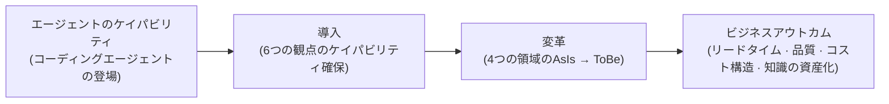
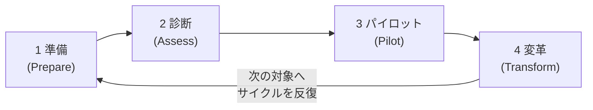

# Vibe Adoption Framework (VAF)

ロボコが提案する、既存企業のバイブコーディング導入のためのフレームワーク

## 1. 概要 (Executive Summary)

Vibe Adoption Framework（VAF）は、既存企業がソフトウェア開発をエージェント中心へ転換するジャーニーを構造化したフレームワークである。ロボコが多様な企業のバイブコーディングおよびAX（AI Transformation）コンサルティングで蓄積した経験とベストプラクティスをもとに、組織が何を準備し（ケイパビリティ）、どこを変え（変革領域）、どの順序で進むべきか（ジャーニー）を一つの体系として提示する。

バイブコーディング（Vibe Coding）とは、人が意図を提示し、AIエージェントがコードを書く開発方式を指す。今この転換を検討すべき理由は明確である。コーディングエージェントのケイパビリティは、すでに熟練開発者が担っていた相当数の作業を代替できる水準に達しており、その差は広がり続けている。エージェントを組織の開発体系に統合した企業は、高水準の開発人材を低コストで大規模に確保したのと同じ効果を享受する一方、個人の実験の水準にとどまる企業は、ツールを使いながらも組織レベルの成果へ結びつけられない。差を生むのはツールではなく**導入の体系**である。

バイブコーディングを体系的に導入した組織は、次のようなアウトカムを期待できる。

- **リードタイムの短縮**: アイデアが動くソフトウェアになるまでの時間が短くなる。機能開発、バグ修正、レガシー分析といった作業が並列に、常時進行する。
- **品質の一貫性**: 人のコンディションと熟練度によって揺れていたレビュー・検証が、自動化されたハーネス（harness）へ移り、一貫して強制される。
- **開発コスト構造の変化**: 人員規模に比例していた開発キャパシティ（capacity）の限界が緩和され、同じ人員で扱えるシステムの範囲が広がる。
- **知識の資産化**: メンバーの頭の中にあった暗黙知が、エージェントが常時活用する文書化された知識基盤へ転換され、特定個人への依存が減る。

VAFは三つの軸で構成される。第一に、組織が備えるべきケイパビリティを6つの**観点（perspective）**と、その下位の**ケイパビリティ（capability）**として定義する。第二に、変革が実際に起こる4つの**変革領域（transformation domain）**を識別する。第三に、導入を実行する4段階の反復的な**導入ジャーニー（adoption journey）**を提示する。本書は経営陣とITリーダーの双方を読者とし、各観点ごとに主要なステークホルダーを明示する。組織の規模や産業にかかわらず適用できるよう一般化した原則として記述するが、必要な箇所には具体的なツール例を添えた。

## 2. 大前提と貫通する原理

### 2.1 大前提: バイブコーディングはソフトウェア開発である

VAFの大前提は次のとおりである。**バイブコーディングだからといって、人が開発するのと異ならない。**バイブコーディングは、既存のソフトウェア開発のベストプラクティスとアンチパターンをそのまま共有する。明確な要求、良いアーキテクチャ、コードレビュー、テスト、文書化、漸進的改善 — 人の開発を成功させてきた原則が、エージェントの開発も成功させる。逆に、曖昧な要求、放置されたレガシー、検証なきデプロイのように、人を失敗させてきた要因は、エージェントも同じように失敗させる。

変わるのは原則ではなく**経済性**である。かつては多くの時間とコスト、専門人材を要した作業 — 綿密なコードレビュー、徹底したテスト、詳細な文書化、レガシー全体の分析 — を、エージェントが低コストで常時遂行できるようになった。したがってバイブコーディングの導入とは、見慣れない方法論を新たに学ぶことではなく、すでに知っていた良い開発文化を、エージェントというてこを用いてついに実現することである。この認識は導入戦略全体を貫く。組織は「AIのために何を変えるべきか」ではなく、「本来やるべきだったことを、エージェントとともにどう実現するか」を問うべきである。

### 2.2 貫通する原理

次の三つの原理は、VAFのすべての観点とジャーニー段階に反映される設計原理である。

#### 原理1: エージェントは人材レバレッジである

エージェント導入の本質は、高水準の人材を安価に大規模に雇用したのと同じ効果を得ることである。この観点を取れば、多くの意思決定が明確になる。新たに加わった有能な開発者に何をしてやるべきか。アクセス権限を与え、システムを説明し、組織のルールを伝え、仕事を任せ、結果をレビューする。エージェントにも、まさに同じものが必要である — システムへのアクセス経路、文書化された知識、明文化されたルール、明確な作業指示、そして検証体系。エージェントが成果を出せないなら、それはたいてい「新人に引き継ぎなしで仕事をさせた」状況と同じである。導入に失敗する組織はエージェントを責めるが、成功する組織はオンボーディングの体系を作る。

#### 原理2: コードはエージェントが書き、オーナーシップは人が持つ

バイブコーディングの導入が完成した組織では、人がコードを手で書くことはない。すべてエージェントが書く。しかし**オーナーシップは人が持つ。**すべてのコード、すべてのシステムには責任を持つ人がいなければならず、その人は、誰かに問われたならいつでも答えられるよう備えていなければならない。この原理は、「エージェントが作ったのだから私は知らない」を組織で許容しないという宣言である。作成の主体が変わっても、説明の義務は移らない。したがって導入の成否は、コードをどれだけ速く生産するかではなく、人が理解と統制を保ったまま生産速度をどれだけ引き上げるかで評価されなければならない。

#### 原理3: 認知負債は除去ではなく管理の対象である

人が自ら書いていないコードが増えると、システムに対する人の理解と、実際のシステムとの間に乖離が生じる。これが**認知負債（cognitive debt）**である。技術的負債（technical debt）が「後で返すことにして先送りした設計品質」であるなら、認知負債は「後で理解することにして先送りしたシステム理解」である。そして技術的負債と同じく、認知負債はなくせるものではなく、トレードオフを勘案して管理すべき対象である。すべてのコードをすべての人が完全に理解しようとすれば、エージェントがもたらす速度の利点が失われ、理解を完全に放棄すれば、オーナーシップの原理が崩れる。組織は、どこに深い理解を維持し、どこに要約された理解を許容するかを明示的に決定し、その決定を定期的に再評価せよ。認知負債の管理水準を決めるのは、個人ではなく組織でなければならない。

### 2.3 名づけられた中核概念

貫通する原理とあわせて、VAF全般で用いる二つの中核概念を定義する。

#### ハーネスエンジニアリング (Harness Engineering)

ハーネスエンジニアリングとは、人が担っていたレビューと、人が作っていたガードレールを、AIが代わりに遂行するよう体系化する工学である。コードレビュー、コーディング規約の検査、セキュリティ点検、テストの強制、デプロイ前の検証 — 伝統的にシニア開発者の時間と組織のプロセスが担っていた品質統制を、ルールファイル・自動レビュー・フック（hook）・検証パイプラインの組み合わせで実装する。ハーネスは、エージェントの成果物を濾し取るフィルターであると同時に、エージェントが組織の基準の内側で存分に作業できるようにする安全装置でもある。よく作られたハーネスは、人のレビュー負担を減らすのではなく、人のレビューを**より高い抽象度**（意図、設計、トレードオフ）へ引き上げる。

#### 嗜好と非嗜好の区分

組織の開発ルールは二つに分かれる。**非嗜好（non-preference）**は交渉の対象ではないものである — セキュリティポリシー、各種ガードレール、コーディング規約など。非嗜好はすべてリポジトリとともに管理され、組織メンバー全員とすべてのエージェントに強制できなければならない。**嗜好（preference）**は個人の裁量を許す、きわめて限定的な領域である — 文書化の詳細度など、結果品質に影響しない一部。この区分が重要な理由は、エージェントの時代にはルールが文書ではなく実行環境に組み込まれるからである。人にとってルールは破りうる推奨だったが、リポジトリに組み込まれたルールは、エージェントにとって破ることのできない環境になる。組織は何が非嗜好かを明示的に決定し、決めたものは例外なくリポジトリに組み込め。嗜好の領域を広く残すことは、配慮ではなく品質のばらつきの放置である。

## 3. フレームワークの構造とValue Chain

### 3.1 三つの軸

VAFは、それぞれ異なる問いに答える三つの軸で構成される。

- **観点とケイパビリティ (Perspective & Capability)** — *「組織は何を備えるべきか？」* 導入に必要な組織ケイパビリティを6つの観点に分類し、各観点の下に具体的なケイパビリティを定義する。ケイパビリティは診断の単位であり、改善計画の単位である。
- **変革領域 (Transformation Domain)** — *「実際に何が変わるのか？」* バイブコーディングの導入によって変革が起こる4つの領域を識別し、各領域のAsIsとToBeを定義する。
- **導入ジャーニー (Adoption Journey)** — *「どの順序で進めるのか？」* 準備 → 診断 → パイロット → 変革の4段階の反復サイクルで導入を実行する。

三つの軸の関係は次のとおりである。組織は**ジャーニー**に沿って進みながら、各段階で必要な**ケイパビリティ**を備え、そのケイパビリティで**変革領域**のAsIsをToBeへ変える。

### 3.2 Value Chain: ケイパビリティからアウトカムまで

バイブコーディングの導入がビジネス成果へつながる経路を、VAFは一つのバリューチェーン（value chain）として捉える。エージェントという新しいケイパビリティが登場したからといって、成果がひとりでに生まれるわけではない。組織が6つの観点のケイパビリティを備えてエージェントを**導入**し、その導入が4つの領域の**変革**を引き起こし、変革が積み重なって、はじめて**ビジネスアウトカム**になる。

このバリューチェーンは、導入の議論でよくある二つの落とし穴を避けさせてくれる。第一に、ツールの導入を成果と取り違える落とし穴 — エージェントのライセンス購入は、チェーンの最初のマスにすぎない。第二に、成果をすぐに求める落とし穴 — 変革なしにアウトカムを測れば、「AIを使ったのに変わったものがない」という誤った結論に至る。経営陣は、このチェーンのどのマスが現在のボトルネックかを問え。それが投資の優先順位である。

### 3.3 軸と軸の関係についての注意

**Knowledgeは二つの軸の両方に登場する。**観点としてのKnowledge（知識基盤）は「エージェントに知識を供給する組織ケイパビリティ」を扱い、変革領域としての知識（Knowledge）は「知識管理の方式そのものが、暗黙知から文書化された資産へ変わる変革」を扱う。前者は備えるものであり、後者は変わるものである。これは偶然の重複ではなく、知識がバイブコーディングの導入において手段であり対象でもある、という事実の反映である。

## 4. Transformation Domain

バイブコーディングの導入によって変革が起こる領域は四つである。各領域ごとにAsIs（導入前）とToBe（導入後）を定義し、変革を支える観点を示す。組織ごとに変革の速度は異なるが、方向は同じである。自らの組織が各領域でどのあたりにいるかを見極めることが、診断の出発点である。

### 4.1 コード生産 (Code)

**AsIs**: 人がコードを書く。開発キャパシティは開発者数と熟練度に比例し、採用がそのままキャパシティ計画である。

**ToBe**: エージェントがコードを書き、人は意図を指示して結果を承認する。人の役割は「どう実装するか」から「何を、なぜ作るか」へ移る。

この変革は最も目立つが、単独では完成しない。エージェントがアクセスできる環境（Agent Environment）、参照する知識（Knowledge）、守るべきルール（Governance & Guardrails）が備わっていなければ、コード生産の変革は個人の実験の水準を越えられない。期待されるアウトカムは、リードタイムの短縮と開発キャパシティの拡大である。

### 4.2 品質保証 (Quality)

**AsIs**: 人がレビューし、手動で検証する。品質はレビュアーのケイパビリティと可用時間に左右され、スケジュールの圧迫が強まると真っ先に犠牲になる。

**ToBe**: ハーネスがレビューとガードレールを自動で遂行する。コーディング規約・セキュリティ・テストがリポジトリに組み込まれて例外なく強制され、人のレビューは意図と設計判断に集中する。

この変革の核心は、品質統制の主体が人の規律から実行環境へ移る点にある。ハーネスエンジニアリング（Harness Engineering）観点が直接支え、嗜好／非嗜好の区分（Governance & Guardrails）が何をハーネスに組み込むかを決める。期待されるアウトカムは、品質の一貫性とレビューのボトルネックの解消である。

### 4.3 知識 (Knowledge)

**AsIs**: システムに対する知識が、メンバーの頭の中と口伝にある。文書は作ったときだけ正しく、退職と異動がそのまま知識の損失になる。

**ToBe**: エージェントが常時活用する文書化された知識基盤が、組織の公式な記憶になる。文書化はエージェントが遂行するのでコストが急減し、知識基盤はコードとともに更新される。

かつて文書化が失敗していた理由は、価値がなかったからではなくコストが高かったからである。エージェントはこのコスト構造を変える。この変革はKnowledge観点が直接支え、認知負債管理の原理の物的な基盤でもある — 理解を維持するコストが下がってこそ、オーナーシップの原理が持続可能になる。期待されるアウトカムは、特定個人への依存の解消と、オンボーディング（人とエージェントの双方）の加速である。

### 4.4 組織と役割 (Organization)

**AsIs**: 作成者中心のチーム。開発者のアイデンティティと評価が「コードをどれだけうまく、多く書くか」に結びついている。

**ToBe**: オーナーとオーケストレーター中心のチーム。メンバーは複数のエージェントの作業を指揮し、成果物に対するオーナーシップを負い、システムについていつでも答えられる人として評価される。

四つの領域のうち、最も遅く、最も難しい変革である。ツールは変えられるが、アイデンティティと評価体系は抵抗する。People & Ownership観点が直接支え、Strategy観点が変革の名分と速度を決める。この変革を明示的に扱わない導入は、「ツールは買ったが誰も使わない」状態に帰結する。期待されるアウトカムは、同じ人員でより広いシステムを扱う組織、そして知識損失リスクが管理される組織である。

## 5. PerspectiveとCapability

組織がバイブコーディングを導入するために備えるべきケイパビリティを、6つの観点に分けて定義する。前半の三つの観点（Strategy、People & Ownership、Governance & Guardrails）は**人と組織の観点**であり、導入の方向、ルール、人の変化を扱う。後半の三つの観点（Agent Environment、Knowledge、Harness Engineering）は**エージェントのための技術観点**であり、エージェントが実際に働ける条件を扱う。

各観点は、中核となる問い、主要なステークホルダー、そしてケイパビリティ（capability）で構成される。ケイパビリティは診断（どこが不足しているか）と計画（何から備えるか）の単位である。すべてのケイパビリティを完璧に備えてから始めようとするな。導入ジャーニー（6章）を反復しながら、必要なケイパビリティを漸進的に成熟させるのが正しいアプローチである。

### 5.1 Strategy (戦略)

**中核となる問い**: なぜ導入し、何を得るのか？ | **ステークホルダー**: 経営陣、事業責任者

バイブコーディングの導入は技術プロジェクトではなく、開発体系の転換である。方向と投資と評価基準を定めるのは経営の仕事であり、この観点が脆弱であれば、残る五つの観点の努力は個人技の水準の成果へと散らばる。

#### 導入戦略 (Adoption Strategy)

組織がバイブコーディングを導入する理由と目標状態を明文化するケイパビリティ。導入の目的（コストか、速度か、品質か、人材リスクの解消か）を優先順位とともに文書化し、経営陣のスポンサーを明示的に指名せよ。「とりあえずツールを買って配る」アプローチを戦略と取り違えるな — それはバリューチェーン（3.2）の最初のマスにすぎない。期待されるアウトカム: 導入の全期間を通じて意思決定の基準となる、合意された方向。**アンチパターン**: 目的なきツールの配布。6か月後、「活用率が低い」という報告とともに勢いが尽きる。

#### 価値・ROI測定 (Value Measurement)

導入の効果を測定可能な指標として定義し、追跡するケイパビリティ。リードタイム、デプロイ頻度、欠陥率、レビュー所要時間のように、既存の開発成果指標をベースライン（baseline）としてまず測定してから導入を始めよ。エージェントの使用量（トークン、セッション数）はコスト指標であって成果指標ではない — 成果は常にソフトウェアデリバリーの指標で測れ。期待されるアウトカム: 「AIで何が良くなったか」にデータで答える組織。**アンチパターン**: ベースラインなしで始めて成果を証明できず、予算更新の時点で導入そのものが座礁する。

#### SDLCギャップ分析 (SDLC Gap Analysis)

ビジネスに合った理想的なソフトウェア開発ライフサイクル（SDLC）をToBeとして設定し、現在の開発方式（AsIs）とのギャップを整理するケイパビリティ。ToBeは「現在の方式にエージェントを差し込んだ姿」ではなく、「エージェントを前提に設計し直した姿」として描け。ギャップは観点別ケイパビリティの言語で記述し、ギャップの一つひとつが改善計画へつながるようにせよ。期待されるアウトカム: 導入ロードマップの骨格となるギャップ一覧。**アンチパターン**: AsIs分析なしにToBeだけを描くこと。組織が現在地を知らなければ、ロードマップは願望になる。

#### 優先順位ポートフォリオ (Portfolio Prioritization)

どのプロジェクト・リポジトリから変革するかを決めるケイパビリティ。パイロットは、成功時の波及力が大きく、失敗しても事業被害が限定的であり、参加チームの意志がある場所に選定せよ。変革の順序は、技術的難易度ではなく学習価値と拡散効果で定めよ。期待されるアウトカム: 根拠ある変革の順序と、パイロット結果に応じて更新されるポートフォリオ。**アンチパターン**: 最も難しいレガシーから始めること。初期の失敗が「うちの会社には合わない」という組織の語りとして固定化する。

### 5.2 People & Ownership (人とオーナーシップ)

**中核となる問い**: 人の役割は何か？ | **ステークホルダー**: 経営陣、チームリード、HR

コードをエージェントが書く組織では、人の価値は何を書いたかではなく、何に責任を負うかで定義される。この観点は貫通する原理2（オーナーシップ）と3（認知負債）を、組織の制度として実装する。

#### オーナーシップ体系 (Ownership System)

すべてのコードとシステムに責任を持つ人を指名し、その人が「誰に問われてもいつでも答えられる状態」を維持できるようにするケイパビリティ。オーナーシップの単位（リポジトリ、サービス、ドメイン）を定義し、オーナー一覧をリポジトリに明示せよ。オーナーには、答える義務とともに、答えられる状態を維持する時間とツール（知識基盤、エージェントを通じたコード探索）を提供せよ。期待されるアウトカム: 作成主体が変わっても説明責任が維持される組織。**アンチパターン**: オーナーシップを宣言するだけで維持コストを与えないこと — オーナーは名ばかりの決裁者になる。

#### 認知負債管理 (Cognitive Debt Management)

システムに対する人の理解と、実際のシステムとの間の乖離を明示的に管理するケイパビリティ。システムごとに求められる理解水準（中核ドメインは深い理解、周辺は要約された理解）を組織が決定し、文書化せよ。パイロットとふりかえりで「今、我々が説明できないこと」を定期的に点検し、乖離が許容線を越えたら、理解の回復作業（エージェントとのコードリーディング、文書の補強）をバックログに上げよ。期待されるアウトカム: 速度と理解のトレードオフが、個人の不安ではなく組織の決定として管理される状態。**アンチパターン**: 認知負債を個人の誠実さの問題として扱うこと。

#### 役割移行 (Role Transition)

作成者中心の役割と評価を、オーナー・オーケストレーター中心へ再設計するケイパビリティ。職務記述と評価基準における「コード作成量」の位置を、「指揮した作業の成果と成果物に対する責任」へ置き換えよ。シニアにはハーネス設計とレビューの引き上げ（意図・設計水準のレビュー）を、ジュニアにはエージェントとともにシステムを理解する訓練を、新しい役割として提示せよ。期待されるアウトカム: 転換後も成長の道筋が見える組織。**アンチパターン**: 役割の再設計なしにツールだけを支給すること — メンバーは自分の評価基準に合う旧来の方式へ回帰する。

#### ケイパビリティ開発 (Capability Development)

メンバーがエージェントを指揮する能力を体系的に育てるケイパビリティ。意図を明確に記述する方法、作業を検証可能な単位に分ける方法、ハーネスとルールファイルを扱う方法を、組織標準のカリキュラムにせよ。教育は講義ではなく、実際の業務リポジトリでの実習として設計し、うまいメンバーのセッション記録を組織の学習資料として再利用せよ。期待されるアウトカム: 個人差に左右されないエージェント活用の水準。**アンチパターン**: プロンプトのTips共有をケイパビリティ開発と取り違えること — 個人技は継承されない。体系（ルール・スキル・ハーネス）に組み込まれたケイパビリティだけが組織に残る。

#### 文化の変革 (Culture Evolution)

エージェントと働く方式を組織の規範として定着させるケイパビリティ。「エージェントが作ったコードは信じられない」という情緒と、「エージェントがやったのだから私は知らない」という回避を、いずれも明示的に扱え — 前者はハーネスへの信頼で、後者はオーナーシップの原理で置き換える。実験と失敗の事例を共有する場を定例化し、リーダーが率先してエージェントと働く姿を見せよ。期待されるアウトカム: 新しい方式が特別な試みではなくデフォルトになった組織。**アンチパターン**: 文化をポスターと宣言で変えようとすること — 文化は、評価・ルール・環境が変わった結果としてのみ変わる。

### 5.3 Governance & Guardrails (ガバナンスとガードレール)

**中核となる問い**: 何を強制するのか？ | **ステークホルダー**: ガバナンス・セキュリティ責任者、財務

エージェントはルールを破ろうとする意志がない代わりに、ルールが環境に組み込まれていなければルールの存在を知らない。この観点は、組織のポリシーを、エージェントと人の双方に例外なく作動する形へ変えるケイパビリティを扱う。

#### 嗜好／非嗜好の区分 (Preference Segregation)

組織の開発ルールを嗜好と非嗜好に分類し、決定するケイパビリティ（定義は2.3を参照）。セキュリティ、ガードレール、コーディング規約、アーキテクチャ原則は非嗜好に分類し、嗜好として残す領域（文書化の詳細度など）は明示的な一覧に限定せよ。分類への異論は放置せず、決定機構（アーキテクチャ委員会など既存の体系を活用）で判定せよ。期待されるアウトカム: 「これはチームごとに違います」が消えた、論争終結の基準。**アンチパターン**: すべてを嗜好として残す温情主義 — 品質のばらつきがエージェントの速度で増幅される。

#### ポリシーのリポジトリ強制 (Policy as Repository)

非嗜好に分類されたポリシーを、リポジトリとともに管理し、技術的に強制するケイパビリティ。ポリシーをWikiの文書ではなく、リポジトリ内のルールファイル（例: AGENTS.md、CLAUDE.md）、フック、CI検査として実装し、人であれエージェントであれ迂回できないようにせよ。ポリシーの変更は、コード変更と同じ手続き（提案、レビュー、マージ）に従わせよ。期待されるアウトカム: 文書と実態が一致するガバナンス。**アンチパターン**: 規程集はイントラネットに、開発はリポジトリで — 誰も（エージェントも含めて）規程集を読まない。

#### セキュリティ・コンプライアンス (Security & Compliance)

エージェントのアクセスと成果物が、組織のセキュリティ・規制要求を満たすようにするケイパビリティ。エージェントの権限は人と同じ原則（最小権限、監査可能性）で管理し、資格情報・個人情報・機密がエージェントのコンテキストと外部サービスへ流れる経路を識別して統制せよ。エージェントの作業履歴が監査証跡として残るよう、セッション・コミット記録の体系を整えよ。産業規制（金融、医療など）がある組織は、規制当局の観点から「AIが書いたコード」に対する説明責任をオーナーシップ体系と結びつけて準備せよ。期待されるアウトカム: セキュリティ組織が導入の反対者ではなく設計参加者になった状態。**アンチパターン**: セキュリティレビューを導入の最後に受けること — 全面遮断という答えを受け取ることになる。

#### コスト管理 (Cost Management)

エージェント運用コストを可視化し、最適化するケイパビリティ。トークン・ライセンスコストをチーム・プロジェクト単位で測定し、開発成果指標（Value Measurement）とあわせて見て、単位成果あたりのコストで判断せよ。コスト削減のためにエージェントの使用を抑制するのは、たいてい逆効果である — 人の時間のほうがはるかに高い。代わりに、浪費のパターン（反復失敗、過度なコンテキスト）をハーネスと教育で減らせ。期待されるアウトカム: コストの議論が、総額ではなく効率の言語で進む状態。**アンチパターン**: 月額利用料の総額だけを見て上限をかけること — 最も生産的なチームから止まる。

### 5.4 Agent Environment (エージェント環境)

**中核となる問い**: エージェントは働けるか？ | **ステークホルダー**: プラットフォーム・インフラ責任者

有能な人材を採用しておきながら、アカウントもシステムへのアクセス権限も与えなければ、成果は出ない。エージェントも同じである。この観点は、会社のIT環境とビジネスコンテキストに、エージェントが容易にアクセスできる経路を構築するケイパビリティを扱う。導入ジャーニーで最初に備えるべき観点である — 以降の診断・分析・文書化を、すべてエージェントとともに遂行するからである。

#### アクセス経路 (Access Channels)

リポジトリ、イシュートラッカー、ファイルストレージ、クラウド・オンプレミスのインフラなど、組織の中核システムにエージェントがアクセスできる経路を構築するケイパビリティ。開発業務の流れ（イシュー確認 → コード変更 → レビュー → デプロイ確認）をたどりながら、エージェントが詰まる地点を一覧化し、一つずつ開けよ。人だけが通過できる関門（手動承認UI、画面キャプチャに基づく業務）は、APIやCLIの経路で置き換えよ。期待されるアウトカム: エージェントが業務の全過程を、人の中継なしに遂行できる状態。**アンチパターン**: コードリポジトリだけを開けること — イシューもデプロイログも見られないエージェントは、半人前の新人である。

#### ツール連携 (Tool Integration)

社内システムと外部サービスを、エージェントが使えるツールの形へ連携するケイパビリティ。MCP（Model Context Protocol）のような標準プロトコルを優先的に採用し、社内専用システムは標準インターフェースで包んで提供せよ。連携したツールの一覧と使い方そのものを文書化し、エージェントが自ら道具を発見できるようにせよ。期待されるアウトカム: 新しいエージェント・新しいチームが、設定なしに組織のツールエコシステムを活用する状態。**アンチパターン**: チームごとにばらばらの非公式な連携スクリプト — 管理されない経路は、セキュリティホールであり技術的負債である。

#### 実行環境 (Execution Environment)

エージェントがコードを実行・検証できる安全な環境を提供するケイパビリティ。エージェントがテストを回し、ビルドを確認できるサンドボックス・開発環境を標準で提供し、本番環境とは明確な境界を置け。実行結果（テスト、リント、ビルドログ）がエージェントへフィードバックとして返るループを整えよ — 実行してみられないエージェントは、検証されていないコードを出すほかない。期待されるアウトカム: エージェントの成果物が「作成済み」ではなく「検証済み」の状態で到着する開発の流れ。**アンチパターン**: 実行権限なしにコード生成だけをさせること — 検証負担がすべて人へ返ってくる。

#### 権限管理 (Permission Management)

エージェントの資格情報と権限を体系的に管理するケイパビリティ。エージェントに個人アカウントを貸すのではなく、識別可能な専用の資格情報を発行し、誰が（どのエージェントが、誰の指示で）何をしたかを追跡可能にせよ。最小権限の原則を適用しつつ、権限拡大要求の処理手続きを軽くして、ボトルネックにならないようにせよ。期待されるアウトカム: セキュリティ・コンプライアンス（5.3）の要求を満たしつつ、エージェントが実質的に働ける権限体系。**アンチパターン**: メンバー個人トークンの使い回し — 監査証跡が不可能になり、退職一つでパイプラインが止まる。

### 5.5 Knowledge (知識基盤)

**中核となる問い**: エージェントは知っているか？ | **ステークホルダー**: アーキテクト、テックリード

エージェントの成果は、アクセスできる知識の質に比例する。コードは読めるが、なぜそう作ったのか、何が重要で何が廃止予定なのか、組織がどんな懸案を抱えているのかは、コードにはない。この観点は、組織の知識を、エージェントが常時活用できる形へ構築するケイパビリティを扱う。

#### 知識基盤の構築 (Knowledge Base)

組織・システムの知識を、エージェントが探索可能な構造として構築するケイパビリティ。LLM Wikiのように相互参照される文書体系など、エージェントが問いをたどって探索できる形を採用せよ。知識基盤は人向け文書の写しではなく、エージェントの作業参照を第一の目的として設計し、コード変更とともに更新される手続きを整えよ。リソース現況の調査（どんなシステム・リポジトリ・データがあるか）を、知識基盤の骨格としてまず立てよ。期待されるアウトカム: エージェントも新規入社者も「聞ける人」を探さずに仕事を始められる状態。**アンチパターン**: 作ったときだけ正しい一回限りの文書ダンプ — 更新手続きのない知識基盤は、数か月のうちに汚染源になる。

#### リポジトリ分析・文書化 (Repository Documentation)

既存のリポジトリをエージェントで分析し、文書化するケイパビリティ。変革対象のリポジトリごとに、構造、中核となる流れ、依存関係、既知の問題をエージェントに分析させ、文書として残させよ — かつてはシニアの数か月の作業だったが、今やエージェントの初期タスクとして適している。成果物はオーナー（5.2）が検収し、知識基盤へ組み入れよ。期待されるアウトカム: レガシーが「誰も知らないコード」から「文書化された資産」へ変わること。この過程そのものが、認知負債の一括返済でもある。**アンチパターン**: 分析なしにいきなり機能開発から始めること — エージェントは文脈なしに局所最適なコードを積み上げる。

#### 懸案の文書化 (Issue Documentation)

ビジネス懸案とIT懸案を、深層インタビューを通じて文書化するケイパビリティ。経営陣・現場・開発組織を対象としたインタビューをエージェントとともに遂行し（質問設計・記録・整理をエージェントが補助）、組織が実際に解くべき問題を文書にせよ。懸案文書は優先順位ポートフォリオ（5.1）の入力であり、エージェントが作業の「なぜ」を理解するビジネスコンテキストになる。期待されるアウトカム: エージェントの作業が、技術課題ではなくビジネス懸案に整列した状態。**アンチパターン**: 懸案の整理を飛ばして技術転換だけを進めること — 速くなった開発が、重要でない仕事へ向かう。

#### コンテキスト常時活用の体系 (Context Delivery)

蓄積された知識が、エージェントの毎作業に自動で供給されるようにするケイパビリティ。知識が存在することと活用されることは別である。すべてのコンテキストは、ルールファイルとスキルを通じて常時活用できなければならない — リポジトリ別のルールファイルに、当該システムの中核コンテキストと知識基盤の入口を明示し、繰り返し参照される知識はスキルの形にパッケージ化せよ。期待されるアウトカム: エージェントが毎回まっさらから始めるのではなく、組織の蓄積の上で働く状態。**アンチパターン**: 立派なWikiを作っておきながら、エージェント設定で連携しないこと — アクセスできない知識は、ない知識である。

### 5.6 Harness Engineering (ハーネスエンジニアリング)

**中核となる問い**: 品質を誰が守るのか？ | **ステークホルダー**: テックリード、開発チーム

ハーネスは、人が担っていたレビューとガードレールを、AIが代わりに担う体系である（2.3）。この観点は、その体系を実際に構築・運用する工学ケイパビリティを扱う。ハーネスのない組織では、エージェントの速度はそのまま欠陥の速度である。ハーネスのある組織でのみ、「速くて安全な」開発が成立する。

#### ルールファイル管理 (Rules Management)

プロジェクト・リポジトリごとに、エージェントのためのルール（例: AGENTS.md、CLAUDE.md）を構成し、維持するケイパビリティ。ルールファイルには、当該リポジトリの非嗜好ポリシー（5.3）、アーキテクチャ制約、作業慣例を盛り込み、組織共通ルールとリポジトリ別ルールの階層を設計せよ。ルールは短く検証可能に保ち、守られないルールは放置せず、フック・CIで強制するか削除せよ。期待されるアウトカム: どのエージェントをつないでも同じ基準で働くリポジトリ。**アンチパターン**: ルールファイルに願望を百科事典のように積むこと — 長いルールは読まれず、検証されないルールは守られない。

#### スキル・フック構成 (Skills & Hooks)

反復作業をスキルにパッケージ化し、強制すべき動作をフックとして実装するケイパビリティ。組織で繰り返される作業手順（デプロイ点検、リリースノート作成、マイグレーションパターン）をスキルにして、エージェントが組織の方式どおりに遂行するようにせよ。破ってはならないルール（危険コマンドの遮断、コミット規約、セキュリティ検査）は、推奨ではなくフックとして実装し、技術的に強制せよ。スキルとフックもコードである — リポジトリでバージョン管理し、レビューを経て変更せよ。期待されるアウトカム: 個人技が組織資産へ転換される経路。**アンチパターン**: うまい人のノウハウが、その人のセッションだけにとどまること。

#### 自動レビュー (Automated Review)

エージェントの成果物を、人より先にAIがまずレビューする体系を構築するケイパビリティ。コードレビューの一次関門をAIレビュー（規約違反、明白な欠陥、セキュリティ脆弱性）に据え、人のレビューは意図適合性と設計判断に集中させよ。レビュー基準そのものをリポジトリのルールとして管理し、レビュアー（AIであれ人であれ）ごとに基準がぶれないようにせよ。期待されるアウトカム: レビューのボトルネックの解消と、レビュー品質の底上げ — 人のレビューがより高い抽象度へ上がる（2.3）。**アンチパターン**: AIレビューを通過儀礼にすること — 指摘が無視されるレビューは、ないレビューより悪い。指摘の処理（修正または明示的な却下）を手続きに含めよ。

#### 検証パイプライン (Verification Pipeline)

エージェントの成果物が、マージ・デプロイ前に通過すべき自動検証の体系を構築するケイパビリティ。テスト、静的解析、セキュリティスキャン、ビルド検証をパイプラインにまとめ、エージェントが成果物を提出する前に、自らパイプラインを回してみられるようにせよ（5.4 実行環境）。テストカバレッジの乏しいレガシーは、エージェントでテストから補強せよ — 検証なき自動化は、自動化された事故である。期待されるアウトカム: 「動くかどうか人が確認しなければならない」成果物が消えた状態。**アンチパターン**: パイプラインの失敗を人が後始末する慣行 — 失敗ログはエージェントへ返し、自ら直させよ。

#### ハーネス改善ループ (Harness Improvement Loop)

ハーネスを突き抜けて出た欠陥を、ハーネスの改善へ還流させるケイパビリティ。本番障害、レビューで見落とした欠陥、エージェントの反復ミスが発生したら、「誰が悪かったか」ではなく「ハーネスのどの層がこれを捕まえるべきだったか」を問え。ふりかえりの成果物を、ルール・フック・レビュー基準・テストの変更として残し、同じミスが構造的に再発しないようにせよ。期待されるアウトカム: 時間が経つほど堅くなるハーネス — 組織の失敗経験が資産として蓄積される。**アンチパターン**: 事故の後に「エージェント使用禁止」へ回帰すること — 原因はエージェントではなく、ハーネスの空白である。

## 6. 導入ジャーニー

VAFの導入ジャーニーは、準備 → 診断 → パイロット → 変革の4段階で構成される。このジャーニーは一度で終わるプログラムではなく、反復されるサイクルである。一つのパイロット範囲でサイクルを完走したのち、次の対象へ再び入る。組織はサイクルを反復するほど、ケイパビリティ（5章）が成熟し、変革領域（4章）のToBeへ近づく。

ジャーニーに入る前に、一つの順序を強調する。**VAFは診断より環境の準備を先に置く。**伝統的なコンサルティングは診断から始めるが、VAFでは診断・分析・文書化の遂行主体がエージェントである。エージェントが働ける環境を先に備えれば、以降のすべての段階がエージェントの速度で進み、組織は最初の段階から「エージェントとともに働く」経験を始めることになる。

### 6.1 第1段階: 準備 (Prepare)

**目標**: エージェントが組織の環境で実際に働ける条件を作る。

**中核となる活動**:
- パイロット候補システムを中心にアクセス経路を構築 — リポジトリ、イシュートラッカー、ファイルストレージ、インフラ（5.4 アクセス経路）
- ツール連携と専用資格情報の発行、最小権限の設計（5.4 ツール連携、権限管理）
- エージェントがテスト・ビルドを実行できる実行環境の確保（5.4 実行環境）
- セキュリティ組織との初期協議 — 権限・監査の体系を設計に反映（5.3 セキュリティ・コンプライアンス）

**成果物**: エージェントがアクセス可能なシステム一覧、資格情報・権限体系、動作する実行環境

**完了基準**: パイロット対象システムへのアクセス経路と実行環境が確保され、エージェントが代表的な業務1件（例: イシュー確認 → コード修正 → テスト → レビュー依頼）を、人の中継なしに最後まで遂行できる。

### 6.2 第2段階: 診断 (Assess)

**目標**: 組織の懸案と資産をエージェントとともに文書化し、AsIsとToBeのギャップを整理する。

**中核となる活動**:
- 経営陣・現場・開発組織への深層インタビューで、ビジネス・IT懸案を文書化（5.5 懸案の文書化） — 付録のインタビュー質問集を活用
- 既存リポジトリのエージェント分析・文書化（5.5 リポジトリ分析・文書化）
- リソース現況の調査と知識基盤（LLM Wikiなど）の構築（5.5 知識基盤の構築）
- 理想的なSDLCをToBeとして設定し、AsIsとのギャップをケイパビリティの言語で整理（5.1 SDLCギャップ分析）
- 成果ベースラインの測定 — リードタイム、デプロイ頻度、欠陥率、レビュー所要時間（5.1 価値・ROI測定）
- パイロット対象の確定（5.1 優先順位ポートフォリオ）

**成果物**: 懸案文書、リポジトリ分析文書、知識基盤 v1、AsIs/ToBeギャップ一覧、成果ベースライン、パイロット選定案

**完了基準**: 懸案文書・リポジトリ文書・ギャップ一覧・知識基盤 v1 が完成し、パイロットチームとエージェントが参照できる状態である。

### 6.3 第3段階: パイロット (Pilot)

**目標**: 選定した範囲でバイブコーディングの転換を実際に遂行し、拡散可能な形の学びを得る。

**中核となる活動**:
- パイロットリポジトリにルールファイル・スキル・フックを構成（5.6 ルールファイル管理、スキル・フック構成）
- 嗜好／非嗜好ポリシーの確定とリポジトリ強制（5.3） — パイロットでポリシーの実効性を検証
- 自動レビュー・検証パイプラインの稼働（5.6）
- パイロットチームの開発方式の転換 — 新規コードはエージェントが書き、人は指示・レビュー・承認
- 役割移行の初適用とケイパビリティ開発の実習（5.2）
- 定期的なふりかえり — ハーネスの空白、認知負債の状態、指標の変化を点検し、ハーネス改善ループを稼働（5.6）

**成果物**: 動作するハーネス（ルール・スキル・フック・レビュー・パイプライン）、パイロット成果データ、拡散用プレイブック（パイロットで検証された手続きの一般化）

**完了基準**: パイロットチームの新規コードがエージェント作成へ転換され、ハーネスが稼働中であり、ベースライン比の成果指標が測定されている。

### 6.4 第4段階: 変革 (Transform)

**目標**: パイロットの検証された方式を全社へ拡散し、新しい開発方式を組織のデフォルトとして定着させる。

**中核となる活動**:
- プレイブックに基づくチーム別の順次拡散 — 各チームごとに準備・診断の縮小版（アクセス経路、リポジトリ文書化、ルール構成）を反復
- オーナーシップ体系と認知負債管理の全社運用（5.2） — オーナー指名、理解水準の決定、定期点検
- 役割・評価体系の改編の制度化（5.2 役割移行）と、文化定着の活動（5.2 文化の変革）
- 成果指標の常時観測 — リードタイム、デプロイ頻度、変更失敗率・欠陥率、レビュー所要時間
- コスト管理体系の運用（5.3） — 単位成果あたりコストの観点での定期レビュー
- 次サイクルの企画 — 残ったギャップと新しい懸案で、次の準備・診断段階へ入る

**成果物**: 全社拡散の現況、常時稼働の成果ダッシュボード、更新されたギャップ一覧と次サイクル計画

**完了基準**: 対象組織全体への拡散が完了し、人がコードを手で書かない状態がデフォルトになり、オーナーシップ・認知負債管理の体系が運用されている。

### 6.5 ジャーニー運営の原則

- **小さく完走せよ**: 最初のサイクルは範囲を狭めて最後まで完走するほうが、広く手を広げて止まるよりよい。完走の経験が拡散の燃料である。
- **段階を飛ばすな**: 準備なき診断は人の速度で進み、診断なきパイロットは文脈なきコードを生み、パイロットなき変革は検証されていない方式を全社へ強いる。
- **すべての段階で深層インタビューにより確認せよ**: 各段階の成果物はステークホルダーインタビューで検証し、コンテキストを補う。文書が現実とずれたまま次の段階へ移ることが、最も高くつく失敗である。
- **指標はサイクルごとに更新せよ**: ベースライン比の変化を、サイクル単位で報告せよ。経営陣の信頼は、指標の連続性から生まれる。

## 7. 付録: 実行キット

本文のフレームワークを実際の導入活動へ移すためのツール群である。診断段階（6.2）のアセスメントとインタビュー、診断・パイロット段階のワークショップで使う。

### 7.1 Capability成熟度アセスメントチェックリスト

各ケイパビリティを、次の3段階で評価する。

- **不在 (0)**: 当該ケイパビリティが存在しないか、個人の任意の活動にとどまる
- **部分 (1)**: 一部のチーム・一部の領域で作動するが、組織標準ではない
- **定着 (2)**: 組織標準として文書化・強制され、継続的に運用される

判別質問に「一部だけそうだ」なら部分、「組織全体がそうだ」なら定着である。アセスメント結果は、ギャップ一覧（5.1 SDLCギャップ分析）の入力になる。

**Strategy**

| Capability | 判別質問 |
|---|---|
| 導入戦略 | 導入の目的と優先順位が文書として存在し、経営陣のスポンサーが指名されているか？ |
| 価値・ROI測定 | リードタイム・欠陥率など、開発成果のベースラインが測定されているか？ |
| SDLCギャップ分析 | ToBe SDLCとAsIsのギャップが文書として整理されているか？ |
| 優先順位ポートフォリオ | 変革対象と順序が根拠とともに決定されているか？ |

**People & Ownership**

| Capability | 判別質問 |
|---|---|
| オーナーシップ体系 | すべてのリポジトリ・システムに指名されたオーナーがおり、一覧がリポジトリにあるか？ |
| 認知負債管理 | システム別の要求理解水準が、組織の決定として文書化されているか？ |
| 役割移行 | 職務・評価基準に、コード作成量以外の基準（指揮・オーナーシップ）が反映されているか？ |
| ケイパビリティ開発 | エージェント活用の教育が、実習ベースのカリキュラムとして存在するか？ |
| 文化の変革 | エージェントと働く方式がデフォルトであり、失敗事例が共有されているか？ |

**Governance & Guardrails**

| Capability | 判別質問 |
|---|---|
| 嗜好／非嗜好の区分 | 何が強制対象かが一覧として決定されており、異論の判定機構があるか？ |
| ポリシーのリポジトリ強制 | 非嗜好ポリシーがルールファイル・フック・CIで実装され、迂回不可能か？ |
| セキュリティ・コンプライアンス | エージェントの権限・監査証跡の体系が、セキュリティ組織と合意されているか？ |
| コスト管理 | エージェントコストがチーム単位で測定され、成果指標とともに検討されているか？ |

**Agent Environment**

| Capability | 判別質問 |
|---|---|
| アクセス経路 | エージェントがリポジトリ・イシュートラッカー・インフラにアクセスし、業務の流れを完走できるか？ |
| ツール連携 | 社内システムが標準プロトコル（MCPなど）のツールとして連携されているか？ |
| 実行環境 | エージェントがテスト・ビルドを自ら実行し、結果をフィードバックされているか？ |
| 権限管理 | エージェント専用の資格情報と最小権限の体系が運用されているか？ |

**Knowledge**

| Capability | 判別質問 |
|---|---|
| 知識基盤の構築 | エージェントが探索可能な知識基盤が存在し、更新手続きがあるか？ |
| リポジトリ分析・文書化 | 変革対象リポジトリの構造・流れ・問題が文書化されているか？ |
| 懸案の文書化 | ビジネス・IT懸案がインタビューベースで文書化されているか？ |
| コンテキスト常時活用の体系 | 知識がルールファイル・スキルを通じてエージェントに自動供給されているか？ |

**Harness Engineering**

| Capability | 判別質問 |
|---|---|
| ルールファイル管理 | リポジトリ別のルールファイルが存在し、組織共通ルールと階層化されているか？ |
| スキル・フック構成 | 反復手順がスキルとして、強制ルールがフックとして実装され、バージョン管理されているか？ |
| 自動レビュー | AI一次レビューが稼働し、指摘の処理手続きがあるか？ |
| 検証パイプライン | マージ前の自動検証があり、エージェントが事前に自ら回せるか？ |
| ハーネス改善ループ | 欠陥・障害がルール・フック・テストの変更へ還流されているか？ |

### 7.2 深層インタビュー質問集

診断段階（6.2）で使う。インタビューの設計・記録・整理はエージェントが補助し、領域ごとに対象者を変える（ビジネス懸案: 経営陣・事業責任者 / IT懸案・SDLC: 開発リーダー・チーム / 知識管理: 全対象）。

**ビジネス懸案**

1. 今、事業で最も解きたい問題を三つ挙げるなら何か？ そのうち、ソフトウェアがボトルネックなのはどれか？
2. 開発組織に対する最大の不満、あるいは物足りなさは何か？（速度、品質、コミュニケーション、コスト）
3. 6か月以内に変わるとしたら、事業的に最も価値のある変化は何か？
4. かつて試みて失敗した開発改善の活動はあるか？ なぜ失敗したと見ているか？

**IT懸案**

1. 現在の開発組織の最大のボトルネックはどこか？（企画、開発、レビュー、QA、デプロイ、運用）
2. 手をつけるのが怖いシステムは何で、なぜ怖いのか？
3. 特定の個人が去ると止まるシステム・業務はあるか？
4. 反復的に発生する障害・欠陥のパターンはあるか？

**SDLC現況 (AsIs)**

1. アイデアがデプロイに到達する実際の経路と所要時間は？（最近の事例で）
2. コードレビューは誰が、どんな基準で、どれだけかけて行うか？
3. テスト・デプロイはどれだけ自動化されているか？ 手動の段階は何か？
4. コーディング規約・セキュリティポリシーはどこにあり、実際に守られているか？ 何が強制され、何が推奨か？
5. 現在AIツールを使うメンバーはどれだけおり、どう使っているか？

**知識管理の現況**

1. 新しいチームメンバーが加わると、何でシステムを学ぶか？ どれだけかかるか？
2. システム文書はどこにあり、最後に更新されたのはいつか？
3. 「これは○○さんだけが知っている」に該当する知識は何か？
4. 意思決定（なぜこう作ったか）の記録は残っているか？

### 7.3 ワークショップガイド

**診断ワークショップ** — 診断段階の中盤、インタビュー・分析の結果が集まった時点で実施する。

- **目的**: アセスメント結果と懸案文書をステークホルダーとともに検証し、ToBe SDLCとギャップの優先順位を合意する
- **参加者**: 経営陣スポンサー、開発リーダー、セキュリティ・ガバナンス責任者、パイロット候補チームのリード
- **アジェンダ**（半日）: ① アセスメント結果の共有（観点別の成熟度） ② 懸案文書の検証・補完 ③ ToBe SDLCの草案の議論 ④ ギャップの優先順位とパイロット対象の合意
- **成果物**: 合意されたギャップ一覧と優先順位、パイロット選定案、ToBe SDLC合意案

**パイロット着手ワークショップ** — パイロット段階の開始時に、パイロットチームと実施する。

- **目的**: パイロットチームが新しい開発方式・ハーネス・役割を理解し、成功基準に合意する
- **参加者**: パイロットチーム全員、ハーネス構成の担当、経営陣スポンサー（開始・締めに参加）
- **アジェンダ**（1日）: ① 貫通する原理とオーナーシップの原理の共有 ② パイロットリポジトリのルール・ハーネスのデモ ③ 実習 — 実際のバックログアイテムをエージェントと完走 ④ 役割・ふりかえり周期・成功基準（完了基準と指標）の合意
- **成果物**: パイロット運営合意書（範囲、役割、ふりかえり周期、成功基準）

### 7.4 用語集

| 用語 | 定義 |
|---|---|
| バイブコーディング (Vibe Coding) | 人が意図を提示し、AIエージェントがコードを書く開発方式 |
| エージェント (Agent) | ツールを使って多段階の作業を自律的に遂行するAIシステム。本書では主にコーディングエージェント |
| 観点 (Perspective) | 導入に必要な組織ケイパビリティの分類軸。VAFは6つの観点を定義する |
| ケイパビリティ (Capability) | 観点を構成する、診断・計画の単位ケイパビリティ |
| 変革領域 (Transformation Domain) | 導入によって実際の変化が起こる領域。コード生産、品質保証、知識、組織と役割 |
| 導入ジャーニー (Adoption Journey) | 準備→診断→パイロット→変革の4段階の反復サイクル |
| ハーネス (Harness) | 人が担っていたレビュー・ガードレールを、AIが代わりに遂行するよう作った体系。ルールファイル・スキル・フック・自動レビュー・検証パイプラインの総称 |
| ハーネスエンジニアリング (Harness Engineering) | ハーネスを構築・運用・改善する工学 |
| 認知負債 (Cognitive Debt) | システムに対する人の理解と、実際のシステムとの間の乖離。管理の対象であり、除去の対象ではない |
| 技術的負債 (Technical Debt) | 後で返すことにして先送りした設計・実装品質 |
| 嗜好／非嗜好 (Preference / Non-preference) | 個人裁量を許す領域と、組織が強制する領域の区分。非嗜好はリポジトリとともに強制される |
| オーナーシップの原理 (Ownership Principle) | コードはエージェントが書き、責任は人が負い、オーナーはいつでも答えられなければならない、という原理 |
| ルールファイル (Rules File) | リポジトリに置くエージェント用のルール文書（例: AGENTS.md、CLAUDE.md） |
| スキル (Skill) | エージェントが組織の方式どおりに反復作業を遂行するようパッケージ化した手続き |
| フック (Hook) | エージェントの特定の動作時点で強制的に実行される検査・遮断の仕組み |
| LLM Wiki | エージェントが探索・活用しやすい形で相互参照されるよう構築した、文書型の知識基盤 |
| MCP (Model Context Protocol) | エージェントと外部ツール・データを連携する標準プロトコル |
| AsIs / ToBe | 現在の状態 / 目標の状態 |
| ベースライン (Baseline) | 導入前に測定しておく成果指標の出発点 |
| DORA指標 | リードタイム、デプロイ頻度、変更失敗率、復旧時間など、ソフトウェアデリバリーの成果指標 |
