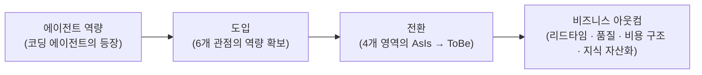

# Vibe Adoption Framework (VAF)

로보코가 제안하는, 기존 기업의 바이브 코딩 도입을 위한 프레임워크

## 1. 개요 (Executive Summary)

Vibe Adoption Framework(VAF)는 기존 기업이 소프트웨어 개발을 에이전트 중심으로 전환하는 여정을 구조화한 프레임워크다. 로보코가 다양한 기업의 바이브 코딩 및 AX(AI Transformation) 컨설팅에서 축적한 경험과 베스트 프랙티스를 바탕으로, 조직이 무엇을 준비하고(역량), 어디를 바꾸며(전환 영역), 어떤 순서로 나아가야 하는지(여정)를 하나의 체계로 제시한다.

바이브 코딩(Vibe Coding)이란 사람이 의도를 제시하고 AI 에이전트가 코드를 작성하는 개발 방식을 말한다. 지금 이 전환을 검토해야 하는 이유는 분명하다. 코딩 에이전트의 역량은 이미 숙련 개발자가 수행하던 상당수의 작업을 대신할 수 있는 수준에 도달했고, 그 격차는 계속 벌어지고 있다. 에이전트를 조직의 개발 체계에 통합한 기업은 고수준 개발 인력을 낮은 비용으로 대규모로 확보한 것과 같은 효과를 누리는 반면, 개인의 실험 수준에 머무는 기업은 도구를 쓰면서도 조직 차원의 성과로 연결하지 못한다. 차이를 만드는 것은 도구가 아니라 **도입의 체계**다.

바이브 코딩을 체계적으로 도입한 조직은 다음과 같은 아웃컴을 기대할 수 있다.

- **리드타임 단축**: 아이디어가 동작하는 소프트웨어가 되기까지의 시간이 줄어든다. 기능 개발, 버그 수정, 레거시 분석과 같은 작업이 병렬로, 상시로 진행된다.
- **품질의 일관성**: 사람의 컨디션과 숙련도에 따라 흔들리던 리뷰·검증이 자동화된 하네스(harness)로 옮겨가 일관되게 강제된다.
- **개발 비용 구조의 변화**: 인력 규모에 비례하던 개발 용량(capacity)의 한계가 완화되고, 같은 인력으로 다룰 수 있는 시스템의 범위가 넓어진다.
- **지식의 자산화**: 구성원의 머릿속에 있던 암묵지가 에이전트가 상시 활용하는 문서화된 지식기반으로 전환되어, 특정 개인에 대한 의존이 줄어든다.

VAF는 세 개의 축으로 구성된다. 첫째, 조직이 갖추어야 할 역량을 6개의 **관점(perspective)** 과 그 하위 **역량 항목(capability)** 으로 정의한다. 둘째, 전환이 실제로 일어나는 4개의 **전환 영역(transformation domain)** 을 식별한다. 셋째, 도입을 실행하는 4단계의 반복적 **도입 여정(adoption journey)** 을 제시한다. 이 문서는 경영진과 IT 리더 모두를 독자로 하며, 각 관점마다 주요 이해관계자를 명시한다. 조직의 규모나 산업에 관계없이 적용할 수 있도록 일반화된 원칙으로 서술하되, 필요한 곳에는 구체적인 도구 예시를 덧붙였다.

## 2. 대전제와 관통 원리

### 2.1 대전제: 바이브 코딩은 소프트웨어 개발이다

VAF의 대전제는 다음과 같다. **바이브 코딩이라고 해서 사람이 개발하는 것과 다르지 않다.** 바이브 코딩은 기존 소프트웨어 개발의 베스트 프랙티스와 안티패턴을 그대로 공유한다. 명확한 요구사항, 좋은 아키텍처, 코드 리뷰, 테스트, 문서화, 점진적 개선 — 사람의 개발을 성공시키던 원칙들이 에이전트의 개발도 성공시킨다. 반대로 모호한 요구사항, 방치된 레거시, 검증 없는 배포처럼 사람을 실패하게 만들던 요인들은 에이전트도 똑같이 실패하게 만든다.

달라지는 것은 원칙이 아니라 **경제성**이다. 과거에는 많은 시간과 비용, 전문 인력이 필요했던 일들 — 꼼꼼한 코드 리뷰, 철저한 테스트, 상세한 문서화, 레거시 전체에 대한 분석 — 을 에이전트가 낮은 비용으로 상시 수행할 수 있게 되었다. 따라서 바이브 코딩 도입이란 낯선 방법론을 새로 배우는 일이 아니라, 이미 알고 있던 좋은 개발 문화를 에이전트라는 지렛대로 마침내 실현하는 일이다. 이 인식은 도입 전략 전체를 관통한다. 조직은 "AI를 위해 무엇을 바꿔야 하는가"가 아니라 "우리가 원래 했어야 할 것을 에이전트와 함께 어떻게 실현할 것인가"를 물어야 한다.

### 2.2 관통 원리

다음 세 가지 원리는 VAF의 모든 관점과 여정 단계에 반영되는 설계 원리다.

#### 원리 1: 에이전트는 인력 레버리지다

에이전트 도입의 본질은 고수준의 인력을 싼 값에 대규모로 고용한 것과 같은 효과를 얻는 것이다. 이 관점을 취하면 많은 의사결정이 명확해진다. 새로 합류한 유능한 개발자에게 무엇을 해주어야 하는가? 접근 권한을 주고, 시스템을 설명해 주고, 조직의 규칙을 알려주고, 일을 맡기고, 결과를 리뷰한다. 에이전트에게도 정확히 같은 것이 필요하다 — 시스템에 대한 접근 통로, 문서화된 지식, 명문화된 규칙, 명확한 작업 지시, 그리고 검증 체계. 에이전트가 성과를 내지 못한다면 그것은 대개 "신입에게 인수인계 없이 일을 시킨" 상황과 같다. 도입에 실패하는 조직은 에이전트를 탓하지만, 성공하는 조직은 온보딩 체계를 만든다.

#### 원리 2: 코드는 에이전트가 쓰고, 오너십은 사람이 가진다

바이브 코딩 도입이 완성된 조직에서는 사람이 코드를 손으로 작성하지 않는다. 전부 에이전트가 작성한다. 그러나 **오너십은 사람이 가진다.** 모든 코드, 모든 시스템에는 책임지는 사람이 있어야 하며, 그 사람은 누군가 물어본다면 언제든지 대답할 수 있게 준비되어 있어야 한다. 이 원리는 "에이전트가 만들었으니 나는 모른다"를 조직에서 허용하지 않겠다는 선언이다. 작성의 주체가 바뀌어도 설명의 의무는 이동하지 않는다. 따라서 도입의 성패는 코드를 얼마나 빨리 생산하는가가 아니라, 사람이 이해와 통제를 유지한 채로 생산 속도를 얼마나 끌어올리는가로 평가되어야 한다.

#### 원리 3: 인지부채는 제거가 아니라 관리의 대상이다

사람이 직접 작성하지 않은 코드가 늘어나면, 시스템에 대한 사람의 이해와 실제 시스템 사이에 간극이 생긴다. 이것이 **인지부채(cognitive debt)** 다. 기술부채(technical debt)가 "나중에 갚기로 하고 미룬 설계 품질"이라면, 인지부채는 "나중에 이해하기로 하고 미룬 시스템 이해"다. 그리고 기술부채와 마찬가지로, 인지부채는 없앨 수 있는 것이 아니라 트레이드오프를 따져 관리해야 하는 대상이다. 모든 코드를 모든 사람이 완전히 이해하려 들면 에이전트가 주는 속도의 이점이 사라지고, 이해를 완전히 포기하면 오너십 원칙이 무너진다. 조직은 어디에 깊은 이해를 유지하고 어디에 요약된 이해를 허용할지 명시적으로 결정하고, 그 결정을 주기적으로 재평가하라. 인지부채의 관리 수준을 결정하는 것은 개인이 아니라 조직이어야 한다.

### 2.3 이름 붙은 핵심 개념

관통 원리와 함께, VAF 전반에서 사용하는 두 가지 핵심 개념을 정의한다.

#### 하네스 엔지니어링 (Harness Engineering)

하네스 엔지니어링이란 사람이 수행하던 리뷰와 사람이 만들던 가드레일을 AI가 대신 수행하도록 체계화하는 공학이다. 코드 리뷰, 코딩 규약 검사, 보안 점검, 테스트 강제, 배포 전 검증 — 전통적으로 시니어 개발자의 시간과 조직의 프로세스가 담당하던 품질 통제를, 규칙 파일·자동 리뷰·훅(hook)·검증 파이프라인의 조합으로 구현한다. 하네스는 에이전트의 산출물을 걸러내는 필터인 동시에, 에이전트가 조직의 기준 안에서 마음껏 작업할 수 있게 하는 안전장치다. 잘 만들어진 하네스는 사람의 리뷰 부담을 줄이는 것이 아니라, 사람의 리뷰를 **더 높은 추상화 수준**(의도, 설계, 트레이드오프)으로 끌어올린다.

#### 취향과 비취향의 구분

조직의 개발 규칙은 두 부류로 나뉜다. **비취향(non-preference)** 은 협상의 대상이 아닌 것들이다 — 보안 정책, 각종 가드레일, 코딩 규약 등. 비취향은 모두 리포지토리와 함께 관리되며 조직 구성원 전원과 모든 에이전트에게 강제될 수 있어야 한다. **취향(preference)** 은 개인의 재량을 허용하는 극히 제한적인 영역이다 — 문서화의 상세 수준 등 결과 품질에 영향을 주지 않는 일부. 이 구분이 중요한 이유는, 에이전트 시대에는 규칙이 문서가 아니라 실행 환경에 내장되기 때문이다. 사람에게 규칙은 어길 수 있는 권고였지만, 저장소에 내장된 규칙은 에이전트에게 어길 수 없는 환경이 된다. 조직은 무엇이 비취향인지 명시적으로 결정하고, 결정한 것은 예외 없이 저장소에 내장하라. 취향의 영역을 넓게 남겨두는 것은 배려가 아니라 품질 편차의 방치다.

## 3. 프레임워크 구조와 Value Chain

### 3.1 세 개의 축

VAF는 서로 다른 질문에 답하는 세 개의 축으로 구성된다.

- **관점과 역량 항목 (Perspective & Capability)** — *"조직이 무엇을 갖추어야 하는가?"* 도입에 필요한 조직 역량을 6개 관점으로 분류하고, 각 관점 아래에 구체적인 역량 항목을 정의한다. 역량 항목은 진단의 단위이자 개선 계획의 단위다.
- **전환 영역 (Transformation Domain)** — *"실제로 무엇이 바뀌는가?"* 바이브 코딩 도입으로 전환이 일어나는 4개 영역을 식별하고, 각 영역의 AsIs와 ToBe를 정의한다.
- **도입 여정 (Adoption Journey)** — *"어떤 순서로 진행하는가?"* 준비 → 진단 → 파일럿 → 전환의 4단계 반복 사이클로 도입을 실행한다.

세 축의 관계는 다음과 같다. 조직은 **여정**을 따라 나아가면서, 각 단계에서 필요한 **역량 항목**을 갖추고, 그 역량으로 **전환 영역**의 AsIs를 ToBe로 바꾼다.

### 3.2 Value Chain: 역량에서 아웃컴까지

바이브 코딩 도입이 비즈니스 성과로 이어지는 경로를 VAF는 하나의 가치 사슬(value chain)로 본다. 에이전트라는 새로운 역량이 등장했다고 해서 성과가 저절로 만들어지지 않는다. 조직이 6개 관점의 역량을 갖추어 에이전트를 **도입**하고, 그 도입이 4개 영역의 **전환**을 일으키며, 전환이 누적되어 비로소 **비즈니스 아웃컴**이 된다.

이 가치 사슬은 도입 논의에서 흔한 두 가지 함정을 피하게 해준다. 첫째, 도구 도입을 성과로 착각하는 함정 — 에이전트 라이선스 구매는 사슬의 첫 칸일 뿐이다. 둘째, 성과를 바로 요구하는 함정 — 전환 없이 아웃컴을 측정하면 "AI를 썼는데 달라진 게 없다"는 잘못된 결론에 도달한다. 경영진은 이 사슬의 어느 칸이 현재 병목인지를 물어라. 그것이 투자 우선순위다.

### 3.3 축과 축의 관계에 대한 주의

**Knowledge는 두 축에 모두 등장한다.** 관점으로서의 Knowledge(지식기반)는 "에이전트에게 지식을 공급하는 조직 역량"을 다루고, 전환 영역으로서의 지식(Knowledge)은 "지식 관리 방식 자체가 암묵지에서 문서화된 자산으로 바뀌는 전환"을 다룬다. 전자는 갖추는 것이고 후자는 바뀌는 것이다. 이는 우연한 중복이 아니라, 지식이 바이브 코딩 도입에서 수단이자 대상이라는 사실의 반영이다.

## 4. Transformation Domain

바이브 코딩 도입으로 전환이 일어나는 영역은 네 곳이다. 각 영역마다 AsIs(도입 전)와 ToBe(도입 후)를 정의하고, 전환을 뒷받침하는 관점을 표시한다. 조직마다 전환의 속도는 다르지만 방향은 같다. 자신의 조직이 각 영역에서 어디쯤 있는지를 가늠하는 것이 진단의 출발점이다.

### 4.1 코드 생산 (Code)

**AsIs**: 사람이 코드를 작성한다. 개발 용량은 개발자 수와 숙련도에 비례하고, 채용이 곧 용량 계획이다.

**ToBe**: 에이전트가 코드를 작성하고, 사람은 의도를 지시하고 결과를 승인한다. 사람의 역할은 "어떻게 구현할 것인가"에서 "무엇을 왜 만들 것인가"로 이동한다.

이 전환은 가장 눈에 띄지만, 단독으로는 완성되지 않는다. 에이전트가 접근할 수 있는 환경(Agent Environment), 참조할 지식(Knowledge), 지켜야 할 규칙(Governance & Guardrails)이 갖추어지지 않으면 코드 생산의 전환은 개인의 실험 수준을 넘지 못한다. 기대 아웃컴은 리드타임 단축과 개발 용량의 확대다.

### 4.2 품질 보증 (Quality)

**AsIs**: 사람이 리뷰하고 수동으로 검증한다. 품질은 리뷰어의 역량과 가용 시간에 좌우되며, 일정 압박이 커지면 가장 먼저 희생된다.

**ToBe**: 하네스가 리뷰와 가드레일을 자동으로 수행한다. 코딩 규약·보안·테스트가 저장소에 내장되어 예외 없이 강제되고, 사람의 리뷰는 의도와 설계 판단에 집중된다.

이 전환의 핵심은 품질 통제의 주체가 사람의 규율에서 실행 환경으로 옮겨간다는 점이다. 하네스 엔지니어링(Harness Engineering) 관점이 직접 뒷받침하며, 취향/비취향 구분(Governance & Guardrails)이 무엇을 하네스에 내장할지를 결정한다. 기대 아웃컴은 품질의 일관성과 리뷰 병목의 해소다.

### 4.3 지식 (Knowledge)

**AsIs**: 시스템에 대한 지식이 구성원의 머릿속과 구두 전승에 있다. 문서는 만들 때만 맞고, 퇴사와 이동이 곧 지식 손실이다.

**ToBe**: 에이전트가 상시 활용하는 문서화된 지식기반이 조직의 공식 기억이 된다. 문서화는 에이전트가 수행하므로 비용이 급감하고, 지식기반은 코드와 함께 갱신된다.

과거에 문서화가 실패했던 이유는 가치가 없어서가 아니라 비용이 높아서였다. 에이전트는 이 비용 구조를 바꾼다. 이 전환은 Knowledge 관점이 직접 뒷받침하며, 인지부채 관리 원리의 물적 토대이기도 하다 — 이해를 유지하는 비용이 낮아져야 오너십 원칙이 지속 가능해진다. 기대 아웃컴은 특정 개인 의존의 해소와 온보딩(사람과 에이전트 모두)의 가속이다.

### 4.4 조직과 역할 (Organization)

**AsIs**: 작성자 중심의 팀. 개발자의 정체성과 평가가 "코드를 얼마나 잘, 많이 작성하는가"에 묶여 있다.

**ToBe**: 오너와 오케스트레이터 중심의 팀. 구성원은 여러 에이전트의 작업을 지휘하고, 산출물에 대한 오너십을 지며, 시스템에 대해 언제든 답할 수 있는 사람으로 평가받는다.

네 영역 중 가장 느리고 가장 어려운 전환이다. 도구는 바꿀 수 있지만 정체성과 평가 체계는 저항한다. People & Ownership 관점이 직접 뒷받침하며, Strategy 관점이 전환의 명분과 속도를 결정한다. 이 전환을 명시적으로 다루지 않는 도입은 "도구는 샀는데 아무도 쓰지 않는" 상태로 귀결된다. 기대 아웃컴은 같은 인력으로 더 넓은 시스템을 다루는 조직, 그리고 지식 손실 위험이 관리되는 조직이다.

## 5. Perspective와 Capability

조직이 바이브 코딩을 도입하기 위해 갖추어야 할 역량을 6개의 관점으로 나누어 정의한다. 앞의 세 관점(Strategy, People & Ownership, Governance & Guardrails)은 **사람과 조직의 관점**으로, 도입의 방향과 규칙과 사람의 변화를 다룬다. 뒤의 세 관점(Agent Environment, Knowledge, Harness Engineering)은 **에이전트를 위한 기술 관점**으로, 에이전트가 실제로 일할 수 있는 조건을 다룬다.

각 관점은 핵심 질문, 주요 이해관계자, 그리고 역량 항목(capability)들로 구성된다. 역량 항목은 진단(어디가 부족한가)과 계획(무엇부터 갖출 것인가)의 단위다. 모든 역량 항목을 완벽히 갖춘 뒤에 시작하려 하지 마라. 도입 여정(6장)을 반복하면서 필요한 역량을 점진적으로 성숙시키는 것이 올바른 접근이다.

### 5.1 Strategy (전략)

**핵심 질문**: 왜 도입하며, 무엇을 얻는가? | **이해관계자**: 경영진, 사업 책임자

바이브 코딩 도입은 기술 프로젝트가 아니라 개발 체계의 전환이다. 방향과 투자와 평가 기준을 정하는 것은 경영의 일이며, 이 관점이 부실하면 나머지 다섯 관점의 노력은 개인기 수준의 성과로 흩어진다.

#### 도입 전략 (Adoption Strategy)

조직이 바이브 코딩을 도입하는 이유와 목표 상태를 명문화하는 역량. 도입의 목적(비용인가, 속도인가, 품질인가, 인력 리스크 해소인가)을 우선순위와 함께 문서화하고, 경영진 스폰서를 명시적으로 지정하라. "일단 도구를 사서 나눠주는" 접근을 전략으로 착각하지 마라 — 그것은 가치 사슬(3.2)의 첫 칸에 불과하다. 기대 아웃컴: 도입 전체 기간 동안 의사결정의 기준이 되는 합의된 방향. **안티패턴**: 목적 없는 도구 배포. 6개월 뒤 "활용률이 낮다"는 보고와 함께 동력이 소진된다.

#### 가치·ROI 측정 (Value Measurement)

도입의 효과를 측정 가능한 지표로 정의하고 추적하는 역량. 리드타임, 배포 빈도, 결함률, 리뷰 소요 시간처럼 기존 개발 성과 지표를 기준선(baseline)으로 먼저 측정한 뒤 도입을 시작하라. 에이전트 사용량(토큰, 세션 수)은 비용 지표이지 성과 지표가 아니다 — 성과는 언제나 소프트웨어 딜리버리의 지표로 측정하라. 기대 아웃컴: "AI로 무엇이 좋아졌는가"에 데이터로 답하는 조직. **안티패턴**: 기준선 없이 시작해 성과를 증명하지 못하고, 예산 갱신 시점에 도입 자체가 좌초된다.

#### SDLC 갭 분석 (SDLC Gap Analysis)

비즈니스에 맞는 이상적인 소프트웨어 개발수명주기(SDLC)를 ToBe로 설정하고, 현재의 개발 방식(AsIs)과의 갭을 정리하는 역량. ToBe는 "현재 방식에 에이전트를 끼워 넣은 모습"이 아니라 "에이전트 전제로 다시 설계한 모습"으로 그려라. 갭은 관점별 역량 항목의 언어로 기술하여, 갭 하나하나가 개선 계획으로 연결되게 하라. 기대 아웃컴: 도입 로드맵의 뼈대가 되는 갭 목록. **안티패턴**: AsIs 분석 없이 ToBe만 그리는 것. 조직이 현재 위치를 모르면 로드맵은 희망사항이 된다.

#### 우선순위 포트폴리오 (Portfolio Prioritization)

어떤 프로젝트·리포지토리부터 전환할지 결정하는 역량. 파일럿은 성공 시 파급력이 크고, 실패해도 사업 피해가 제한적이며, 참여 팀의 의지가 있는 곳으로 선정하라. 전환 순서는 기술 난이도가 아니라 학습 가치와 확산 효과로 정하라. 기대 아웃컴: 근거 있는 전환 순서와, 파일럿 결과에 따라 갱신되는 포트폴리오. **안티패턴**: 가장 어려운 레거시부터 시작하는 것. 초기 실패가 "우리 회사에는 안 맞는다"는 조직 서사로 굳어진다.

### 5.2 People & Ownership (사람과 오너십)

**핵심 질문**: 사람의 역할은 무엇인가? | **이해관계자**: 경영진, 팀 리드, HR

코드를 에이전트가 작성하는 조직에서 사람의 가치는 무엇을 작성했는가가 아니라 무엇을 책임지는가로 정의된다. 이 관점은 관통 원리 2(오너십)와 3(인지부채)을 조직 제도로 구현한다.

#### 오너십 체계 (Ownership System)

모든 코드와 시스템에 책임지는 사람을 지정하고, 그 사람이 "누가 물어도 언제든 답할 수 있는 상태"를 유지하게 하는 역량. 오너십의 단위(리포지토리, 서비스, 도메인)를 정의하고 오너 목록을 저장소에 명시하라. 오너에게는 답할 의무와 함께, 답할 수 있는 상태를 유지할 시간과 도구(지식기반, 에이전트를 통한 코드 탐색)를 제공하라. 기대 아웃컴: 작성 주체가 바뀌어도 설명 책임이 유지되는 조직. **안티패턴**: 오너십을 선언만 하고 유지 비용을 주지 않는 것 — 오너는 이름뿐인 결재자가 된다.

#### 인지부채 관리 (Cognitive Debt Management)

시스템에 대한 사람의 이해와 실제 시스템 사이의 간극을 명시적으로 관리하는 역량. 시스템별로 요구되는 이해 수준(핵심 도메인은 깊은 이해, 주변부는 요약된 이해)을 조직이 결정하고 문서화하라. 파일럿과 회고에서 "지금 우리가 설명하지 못하는 것"을 정기적으로 점검하고, 간극이 허용선을 넘으면 이해 회복 작업(에이전트와의 코드 리딩, 문서 보강)을 백로그에 올려라. 기대 아웃컴: 속도와 이해 사이의 트레이드오프가 개인의 불안이 아니라 조직의 결정으로 관리되는 상태. **안티패턴**: 인지부채를 개인의 성실성 문제로 취급하는 것.

#### 역할 전환 (Role Transition)

작성자 중심의 역할과 평가를 오너·오케스트레이터 중심으로 재설계하는 역량. 직무 기술과 평가 기준에서 "코드 작성량"의 자리를 "지휘한 작업의 성과와 산출물에 대한 책임"으로 교체하라. 시니어에게는 하네스 설계와 리뷰 상향(의도·설계 수준의 리뷰)을, 주니어에게는 에이전트와 함께 시스템을 이해하는 훈련을 새 역할로 제시하라. 기대 아웃컴: 전환 이후에도 성장 경로가 보이는 조직. **안티패턴**: 역할 재설계 없이 도구만 지급하는 것 — 구성원은 자신의 평가 기준에 맞는 옛 방식으로 회귀한다.

#### 역량 개발 (Capability Development)

구성원이 에이전트를 지휘하는 능력을 체계적으로 기르는 역량. 의도를 명확히 기술하는 법, 작업을 검증 가능한 단위로 나누는 법, 하네스와 규칙 파일을 다루는 법을 조직 표준 커리큘럼으로 만들어라. 교육은 강의가 아니라 실제 업무 리포지토리에서의 실습으로 설계하고, 잘하는 구성원의 세션 기록을 조직의 학습 자료로 재활용하라. 기대 아웃컴: 개인차에 좌우되지 않는 에이전트 활용 수준. **안티패턴**: 프롬프트 팁 공유를 역량 개발로 착각하는 것 — 개인기는 전수되지 않는다. 체계(규칙·스킬·하네스)에 내장된 역량만 조직에 남는다.

#### 문화 전환 (Culture Evolution)

에이전트와 일하는 방식을 조직의 규범으로 정착시키는 역량. "에이전트가 만든 코드는 못 믿는다"는 정서와 "에이전트가 했으니 나는 모른다"는 회피를 모두 명시적으로 다뤄라 — 전자는 하네스에 대한 신뢰로, 후자는 오너십 원칙으로 대체한다. 실험과 실패 사례를 공유하는 장을 정기화하고, 리더가 먼저 에이전트와 일하는 모습을 보여라. 기대 아웃컴: 새 방식이 특별한 시도가 아니라 기본값이 된 조직. **안티패턴**: 문화를 포스터와 선언으로 바꾸려는 것 — 문화는 평가·규칙·환경이 바뀐 결과로만 바뀐다.

### 5.3 Governance & Guardrails (거버넌스와 가드레일)

**핵심 질문**: 무엇을 강제하는가? | **이해관계자**: 거버넌스·보안 책임자, 재무

에이전트는 규칙을 어기려는 의지가 없는 대신, 규칙이 환경에 내장되어 있지 않으면 규칙의 존재를 모른다. 이 관점은 조직의 정책을 에이전트와 사람 모두에게 예외 없이 작동하는 형태로 바꾸는 역량을 다룬다.

#### 취향/비취향 구분 (Preference Segregation)

조직의 개발 규칙을 취향과 비취향으로 분류하고 결정하는 역량(정의는 2.3 참조). 보안, 가드레일, 코딩 규약, 아키텍처 원칙은 비취향으로 분류하고, 취향으로 남길 영역(문서화 상세 수준 등)은 명시적 목록으로 제한하라. 분류에 대한 이견은 방치하지 말고 결정 기구(아키텍처 위원회 등 기존 체계 활용)에서 판정하라. 기대 아웃컴: "이건 팀마다 달라요"가 사라진, 논쟁 종결의 기준. **안티패턴**: 전부 취향으로 남겨두는 온정주의 — 품질 편차가 에이전트의 속도로 증폭된다.

#### 정책의 저장소 강제 (Policy as Repository)

비취향으로 분류된 정책을 리포지토리와 함께 관리하고 기술적으로 강제하는 역량. 정책을 위키의 문서가 아니라 저장소 안의 규칙 파일(예: AGENTS.md, CLAUDE.md), 훅, CI 검사로 구현하여, 사람이든 에이전트든 우회할 수 없게 하라. 정책의 변경은 코드 변경과 같은 절차(제안, 리뷰, 병합)를 따르게 하라. 기대 아웃컴: 문서와 실제가 일치하는 거버넌스. **안티패턴**: 규정집은 인트라넷에, 개발은 저장소에서 — 아무도(에이전트 포함) 규정집을 읽지 않는다.

#### 보안·컴플라이언스 (Security & Compliance)

에이전트의 접근과 산출물이 조직의 보안·규제 요구를 충족하게 하는 역량. 에이전트의 권한은 사람과 동일한 원칙(최소 권한, 감사 가능성)으로 관리하고, 자격증명·개인정보·기밀이 에이전트의 컨텍스트와 외부 서비스로 흘러가는 경로를 식별해 통제하라. 에이전트의 작업 이력이 감사 추적으로 남도록 세션·커밋 기록 체계를 갖춰라. 산업 규제(금융, 의료 등)가 있는 조직은 규제 기관 관점에서 "AI가 작성한 코드"에 대한 설명 책임을 오너십 체계와 연결해 준비하라. 기대 아웃컴: 보안 조직이 도입의 반대자가 아니라 설계 참여자가 된 상태. **안티패턴**: 보안 검토를 도입 마지막에 받는 것 — 전면 차단이라는 답을 받게 된다.

#### 비용 관리 (Cost Management)

에이전트 운용 비용을 가시화하고 최적화하는 역량. 토큰·라이선스 비용을 팀·프로젝트 단위로 측정하고, 개발 성과 지표(Value Measurement)와 함께 보아 단위 성과당 비용으로 판단하라. 비용 절감을 위해 에이전트 사용을 억제하는 것은 대개 역효과다 — 사람의 시간이 훨씬 비싸다. 대신 낭비 패턴(반복 실패, 과도한 컨텍스트)을 하네스와 교육으로 줄여라. 기대 아웃컴: 비용 논쟁이 총액이 아니라 효율의 언어로 진행되는 상태. **안티패턴**: 월 사용료 총액만 보고 상한을 거는 것 — 가장 생산적인 팀부터 멈춘다.

### 5.4 Agent Environment (에이전트 환경)

**핵심 질문**: 에이전트가 일할 수 있는가? | **이해관계자**: 플랫폼·인프라 책임자

유능한 인력을 채용해 놓고 계정도, 시스템 접근 권한도 주지 않으면 성과가 나올 수 없다. 에이전트도 같다. 이 관점은 회사의 IT 환경과 비즈니스 컨텍스트에 에이전트가 손쉽게 접근할 수 있는 통로를 구축하는 역량을 다룬다. 도입 여정에서 가장 먼저 갖춰야 하는 관점이다 — 이후의 진단·분석·문서화를 모두 에이전트와 함께 수행하기 때문이다.

#### 접근 통로 (Access Channels)

리포지토리, 이슈 트래커, 파일 저장소, 클라우드·온프레미스 인프라 등 조직의 핵심 시스템에 에이전트가 접근할 수 있는 통로를 구축하는 역량. 개발 업무의 흐름(이슈 확인 → 코드 변경 → 리뷰 → 배포 확인)을 따라가며 에이전트가 막히는 지점을 목록화하고 하나씩 열어라. 사람만 통과할 수 있는 관문(수동 승인 UI, 화면 캡처 기반 업무)은 API나 CLI 경로로 대체하라. 기대 아웃컴: 에이전트가 업무의 전 과정을 사람의 중계 없이 수행할 수 있는 상태. **안티패턴**: 코드 저장소만 열어주는 것 — 이슈도 배포 로그도 못 보는 에이전트는 반쪽짜리 신입이다.

#### 도구 연결 (Tool Integration)

사내 시스템과 외부 서비스를 에이전트가 사용할 수 있는 도구 형태로 연결하는 역량. MCP(Model Context Protocol)와 같은 표준 프로토콜을 우선 채택하고, 사내 전용 시스템은 표준 인터페이스로 감싸 제공하라. 연결된 도구의 목록과 사용법 자체를 문서화하여 에이전트가 스스로 도구를 발견하게 하라. 기대 아웃컴: 새 에이전트·새 팀이 설정 없이 조직의 도구 생태계를 활용하는 상태. **안티패턴**: 팀마다 제각각의 비공식 연동 스크립트 — 관리되지 않는 통로는 보안 구멍이자 기술부채다.

#### 실행 환경 (Execution Environment)

에이전트가 코드를 실행·검증할 수 있는 안전한 환경을 제공하는 역량. 에이전트가 테스트를 돌리고 빌드를 확인할 수 있는 샌드박스·개발 환경을 기본 제공하고, 운영 환경과는 명확한 경계를 두어라. 실행 결과(테스트, 린트, 빌드 로그)가 에이전트에게 피드백으로 돌아오는 루프를 갖춰라 — 실행해 볼 수 없는 에이전트는 검증되지 않은 코드를 낼 수밖에 없다. 기대 아웃컴: 에이전트 산출물이 "작성됨"이 아니라 "검증됨" 상태로 도착하는 개발 흐름. **안티패턴**: 실행 권한 없이 코드 생성만 시키는 것 — 검증 부담이 전부 사람에게 되돌아온다.

#### 권한 관리 (Permission Management)

에이전트의 자격증명과 권한을 체계적으로 관리하는 역량. 에이전트에게 개인 계정을 빌려주지 말고 식별 가능한 전용 자격증명을 발급하여, 누가(어느 에이전트가, 누구의 지시로) 무엇을 했는지 추적 가능하게 하라. 최소 권한 원칙을 적용하되, 권한 확대 요청의 처리 절차를 가볍게 만들어 병목이 되지 않게 하라. 기대 아웃컴: 보안·컴플라이언스(5.3) 요구를 충족하면서도 에이전트가 실질적으로 일할 수 있는 권한 체계. **안티패턴**: 구성원 개인 토큰의 돌려쓰기 — 감사 추적이 불가능해지고 퇴사 한 번에 파이프라인이 멈춘다.

### 5.5 Knowledge (지식기반)

**핵심 질문**: 에이전트가 아는가? | **이해관계자**: 아키텍트, 테크리드

에이전트의 성과는 접근할 수 있는 지식의 질에 비례한다. 코드는 읽을 수 있지만, 왜 그렇게 만들었는지, 무엇이 중요하고 무엇이 폐기 예정인지, 조직이 어떤 현안을 안고 있는지는 코드에 없다. 이 관점은 조직의 지식을 에이전트가 상시 활용할 수 있는 형태로 구축하는 역량을 다룬다.

#### 지식기반 구축 (Knowledge Base)

조직·시스템 지식을 에이전트가 탐색 가능한 구조로 구축하는 역량. LLM Wiki처럼 상호 참조되는 문서 체계 등, 에이전트가 질문을 따라 탐색할 수 있는 형태를 채택하라. 지식기반은 사람용 문서의 사본이 아니라 에이전트의 작업 참조를 일차 목적으로 설계하고, 코드 변경과 함께 갱신되는 절차를 마련하라. 리소스 현황 조사(어떤 시스템·리포지토리·데이터가 있는가)를 지식기반의 뼈대로 먼저 세워라. 기대 아웃컴: 에이전트와 신규 입사자 모두 "물어볼 사람"을 찾지 않고 일을 시작할 수 있는 상태. **안티패턴**: 만들 때만 맞는 일회성 문서 덤프 — 갱신 절차 없는 지식기반은 몇 달 안에 오염원이 된다.

#### 리포지토리 분석·문서화 (Repository Documentation)

기존 리포지토리를 에이전트로 분석하고 문서화하는 역량. 전환 대상 리포지토리마다 구조, 핵심 흐름, 의존성, 알려진 문제를 에이전트가 분석해 문서로 남기게 하라 — 과거에는 시니어 수개월의 작업이었지만 이제는 에이전트의 초기 과업으로 적합하다. 산출물은 오너(5.2)가 검수하여 지식기반에 편입하라. 기대 아웃컴: 레거시가 "아무도 모르는 코드"에서 "문서화된 자산"으로 바뀌는 것. 이 과정 자체가 인지부채의 일괄 상환이기도 하다. **안티패턴**: 분석 없이 바로 기능 개발부터 시키는 것 — 에이전트는 맥락 없이 국소 최적의 코드를 쌓는다.

#### 현안 문서화 (Issue Documentation)

비즈니스 현안과 IT 현안을 심층인터뷰를 통해 문서화하는 역량. 경영진·현업·개발 조직을 대상으로 한 인터뷰를 에이전트와 함께 수행하여(질문 설계·기록·정리를 에이전트가 보조), 조직이 실제로 풀어야 할 문제를 문서로 만들어라. 현안 문서는 우선순위 포트폴리오(5.1)의 입력이자, 에이전트가 작업의 "왜"를 이해하는 비즈니스 컨텍스트가 된다. 기대 아웃컴: 에이전트의 작업이 기술 과제가 아니라 비즈니스 현안에 정렬된 상태. **안티패턴**: 현안 정리를 건너뛰고 기술 전환만 진행하는 것 — 빨라진 개발이 중요하지 않은 일을 향한다.

#### 컨텍스트 상시 활용 체계 (Context Delivery)

축적된 지식이 에이전트의 매 작업에 자동으로 공급되게 하는 역량. 지식이 존재하는 것과 활용되는 것은 다르다. 모든 컨텍스트는 규칙 파일과 스킬을 통해 상시 활용될 수 있어야 한다 — 리포지토리별 규칙 파일에 해당 시스템의 핵심 컨텍스트와 지식기반 진입점을 명시하고, 반복 참조되는 지식은 스킬 형태로 패키징하라. 기대 아웃컴: 에이전트가 매번 백지에서 시작하지 않고 조직의 축적 위에서 일하는 상태. **안티패턴**: 훌륭한 위키를 만들어 놓고 에이전트 설정에서 연결하지 않는 것 — 접근 안 되는 지식은 없는 지식이다.

### 5.6 Harness Engineering (하네스 엔지니어링)

**핵심 질문**: 품질을 누가 지키는가? | **이해관계자**: 테크리드, 개발팀

하네스는 사람이 하던 리뷰와 가드레일을 AI가 대신하는 체계다(2.3). 이 관점은 그 체계를 실제로 구축·운영하는 공학 역량을 다룬다. 하네스가 없는 조직에서 에이전트의 속도는 곧 결함의 속도다. 하네스가 있는 조직에서만 "빠르면서 안전한" 개발이 성립한다.

#### 규칙 파일 관리 (Rules Management)

프로젝트·리포지토리별로 에이전트를 위한 규칙(예: AGENTS.md, CLAUDE.md)을 구성하고 유지하는 역량. 규칙 파일에는 해당 저장소의 비취향 정책(5.3), 아키텍처 제약, 작업 관례를 담고, 조직 공통 규칙과 저장소별 규칙의 계층을 설계하라. 규칙은 짧고 검증 가능하게 유지하고, 지켜지지 않는 규칙은 방치하지 말고 훅·CI로 강제하거나 삭제하라. 기대 아웃컴: 어떤 에이전트를 붙여도 같은 기준으로 일하는 리포지토리. **안티패턴**: 규칙 파일에 희망사항을 백과사전처럼 쌓는 것 — 긴 규칙은 읽히지 않고, 검증되지 않는 규칙은 지켜지지 않는다.

#### 스킬·훅 구성 (Skills & Hooks)

반복 작업을 스킬로 패키징하고, 강제할 동작을 훅으로 구현하는 역량. 조직에서 반복되는 작업 절차(배포 점검, 릴리스 노트 작성, 마이그레이션 패턴)를 스킬로 만들어 에이전트가 조직의 방식대로 수행하게 하라. 어겨서는 안 되는 규칙(위험 명령 차단, 커밋 규약, 보안 검사)은 권고가 아니라 훅으로 구현하여 기술적으로 강제하라. 스킬과 훅도 코드다 — 저장소에서 버전 관리하고 리뷰를 거쳐 변경하라. 기대 아웃컴: 개인기가 조직 자산으로 전환되는 통로. **안티패턴**: 잘하는 사람의 노하우가 그 사람의 세션에만 머무는 것.

#### 자동 리뷰 (Automated Review)

에이전트 산출물을 사람 이전에 AI가 먼저 리뷰하는 체계를 구축하는 역량. 코드 리뷰의 1차 관문을 AI 리뷰(규약 위반, 명백한 결함, 보안 취약점)로 세우고, 사람의 리뷰는 의도 부합성과 설계 판단에 집중시켜라. 리뷰 기준 자체를 저장소의 규칙으로 관리하여 리뷰어(AI든 사람이든)마다 기준이 흔들리지 않게 하라. 기대 아웃컴: 리뷰 병목의 해소와 리뷰 품질의 상향 평준화 — 사람의 리뷰가 더 높은 추상화 수준으로 올라간다(2.3). **안티패턴**: AI 리뷰를 통과 의례로 만드는 것 — 지적이 무시되는 리뷰는 없는 리뷰보다 나쁘다. 지적의 처리(수정 또는 명시적 기각)를 절차에 포함하라.

#### 검증 파이프라인 (Verification Pipeline)

에이전트 산출물이 병합·배포 전에 통과해야 하는 자동 검증 체계를 구축하는 역량. 테스트, 정적 분석, 보안 스캔, 빌드 검증을 파이프라인으로 묶고, 에이전트가 산출물을 제출하기 전에 스스로 파이프라인을 돌려 볼 수 있게 하라(5.4 실행 환경). 테스트 커버리지가 빈약한 레거시는 에이전트로 테스트부터 보강하라 — 검증 없는 자동화는 자동화된 사고다. 기대 아웃컴: "동작하는지 사람이 확인해야 하는" 산출물이 사라진 상태. **안티패턴**: 파이프라인 실패를 사람이 수습하는 관행 — 실패 로그는 에이전트에게 돌려보내 스스로 고치게 하라.

#### 하네스 개선 루프 (Harness Improvement Loop)

하네스를 뚫고 나온 결함을 하네스의 개선으로 환류시키는 역량. 운영 장애, 리뷰에서 놓친 결함, 에이전트의 반복 실수가 발생하면 "누가 잘못했나"가 아니라 "하네스의 어느 층이 이것을 잡았어야 하나"를 물어라. 회고의 산출물을 규칙·훅·리뷰 기준·테스트의 변경으로 남겨, 같은 실수가 구조적으로 재발하지 않게 하라. 기대 아웃컴: 시간이 지날수록 단단해지는 하네스 — 조직의 실패 경험이 자산으로 축적된다. **안티패턴**: 사고 후 "에이전트 사용 금지"로 회귀하는 것 — 원인은 에이전트가 아니라 하네스의 공백이다.

## 6. 도입 여정

## 7. 부록: 실행 키트
