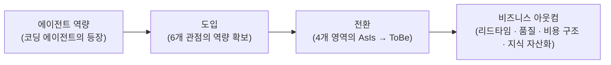

# Vibe Adoption Framework (VAF)

로보코가 제안하는, 기존 기업의 바이브 코딩 도입을 위한 프레임워크

## 1. 개요 (Executive Summary)

Vibe Adoption Framework(VAF)는 기존 기업이 소프트웨어 개발을 에이전트 중심으로 전환하는 여정을 구조화한 프레임워크다. 로보코가 다양한 기업의 바이브 코딩 및 AX(AI Transformation) 컨설팅에서 축적한 경험과 베스트 프랙티스를 바탕으로, 조직이 무엇을 준비하고(역량), 어디를 바꾸며(전환 영역), 어떤 순서로 나아가야 하는지(여정)를 하나의 체계로 제시한다.

바이브 코딩(Vibe Coding)이란 사람이 의도를 제시하고 AI 에이전트가 코드를 작성하는 개발 방식을 말한다. 지금 이 전환을 검토해야 하는 이유는 분명하다. 코딩 에이전트의 역량은 이미 숙련 개발자가 수행하던 상당수의 작업을 대신할 수 있는 수준에 도달했고, 그 격차는 계속 벌어지고 있다. 에이전트를 조직의 개발 체계에 통합한 기업은 고수준 개발 인력을 낮은 비용으로 대규모로 확보한 것과 같은 효과를 누리는 반면, 개인의 실험 수준에 머무는 기업은 도구를 쓰면서도 조직 차원의 성과로 연결하지 못한다. 차이를 만드는 것은 도구가 아니라 **도입의 체계**다.

바이브 코딩을 체계적으로 도입한 조직은 다음과 같은 아웃컴을 기대할 수 있다.

- **리드타임 단축**: 아이디어가 동작하는 소프트웨어가 되기까지의 시간이 줄어든다. 기능 개발, 버그 수정, 레거시 분석과 같은 작업이 병렬로, 상시로 진행된다.
- **품질의 일관성**: 사람의 컨디션과 숙련도에 따라 흔들리던 리뷰·검증이 자동화된 하네스(harness)로 옮겨가 일관되게 강제된다.
- **개발 비용 구조의 변화**: 인력 규모에 비례하던 개발 용량(capacity)의 한계가 완화되고, 같은 인력으로 다룰 수 있는 시스템의 범위가 넓어진다.
- **지식의 자산화**: 구성원의 머릿속에 있던 암묵지가 에이전트가 상시 활용하는 문서화된 지식기반으로 전환되어, 특정 개인에 대한 의존이 줄어든다.

VAF는 세 개의 축으로 구성된다. 첫째, 조직이 갖추어야 할 역량을 6개의 **관점(perspective)** 과 그 하위 **역량 항목(capability)** 으로 정의한다. 둘째, 전환이 실제로 일어나는 4개의 **전환 영역(transformation domain)** 을 식별한다. 셋째, 도입을 실행하는 4단계의 반복적 **도입 여정(adoption journey)** 을 제시한다. 이 문서는 경영진과 IT 리더 모두를 독자로 하며, 각 관점마다 주요 이해관계자를 명시한다. 조직의 규모나 산업에 관계없이 적용할 수 있도록 일반화된 원칙으로 서술하되, 필요한 곳에는 구체적인 도구 예시를 덧붙였다.

## 2. 대전제와 관통 원리

### 2.1 대전제: 바이브 코딩은 소프트웨어 개발이다

VAF의 대전제는 다음과 같다. **바이브 코딩이라고 해서 사람이 개발하는 것과 다르지 않다.** 바이브 코딩은 기존 소프트웨어 개발의 베스트 프랙티스와 안티패턴을 그대로 공유한다. 명확한 요구사항, 좋은 아키텍처, 코드 리뷰, 테스트, 문서화, 점진적 개선 — 사람의 개발을 성공시키던 원칙들이 에이전트의 개발도 성공시킨다. 반대로 모호한 요구사항, 방치된 레거시, 검증 없는 배포처럼 사람을 실패하게 만들던 요인들은 에이전트도 똑같이 실패하게 만든다.

달라지는 것은 원칙이 아니라 **경제성**이다. 과거에는 많은 시간과 비용, 전문 인력이 필요했던 일들 — 꼼꼼한 코드 리뷰, 철저한 테스트, 상세한 문서화, 레거시 전체에 대한 분석 — 을 에이전트가 낮은 비용으로 상시 수행할 수 있게 되었다. 따라서 바이브 코딩 도입이란 낯선 방법론을 새로 배우는 일이 아니라, 이미 알고 있던 좋은 개발 문화를 에이전트라는 지렛대로 마침내 실현하는 일이다. 이 인식은 도입 전략 전체를 관통한다. 조직은 "AI를 위해 무엇을 바꿔야 하는가"가 아니라 "우리가 원래 했어야 할 것을 에이전트와 함께 어떻게 실현할 것인가"를 물어야 한다.

### 2.2 관통 원리

다음 세 가지 원리는 VAF의 모든 관점과 여정 단계에 반영되는 설계 원리다.

#### 원리 1: 에이전트는 인력 레버리지다

에이전트 도입의 본질은 고수준의 인력을 싼 값에 대규모로 고용한 것과 같은 효과를 얻는 것이다. 이 관점을 취하면 많은 의사결정이 명확해진다. 새로 합류한 유능한 개발자에게 무엇을 해주어야 하는가? 접근 권한을 주고, 시스템을 설명해 주고, 조직의 규칙을 알려주고, 일을 맡기고, 결과를 리뷰한다. 에이전트에게도 정확히 같은 것이 필요하다 — 시스템에 대한 접근 통로, 문서화된 지식, 명문화된 규칙, 명확한 작업 지시, 그리고 검증 체계. 에이전트가 성과를 내지 못한다면 그것은 대개 "신입에게 인수인계 없이 일을 시킨" 상황과 같다. 도입에 실패하는 조직은 에이전트를 탓하지만, 성공하는 조직은 온보딩 체계를 만든다.

#### 원리 2: 코드는 에이전트가 쓰고, 오너십은 사람이 가진다

바이브 코딩 도입이 완성된 조직에서는 사람이 코드를 손으로 작성하지 않는다. 전부 에이전트가 작성한다. 그러나 **오너십은 사람이 가진다.** 모든 코드, 모든 시스템에는 책임지는 사람이 있어야 하며, 그 사람은 누군가 물어본다면 언제든지 대답할 수 있게 준비되어 있어야 한다. 이 원리는 "에이전트가 만들었으니 나는 모른다"를 조직에서 허용하지 않겠다는 선언이다. 작성의 주체가 바뀌어도 설명의 의무는 이동하지 않는다. 따라서 도입의 성패는 코드를 얼마나 빨리 생산하는가가 아니라, 사람이 이해와 통제를 유지한 채로 생산 속도를 얼마나 끌어올리는가로 평가되어야 한다.

#### 원리 3: 인지부채는 제거가 아니라 관리의 대상이다

사람이 직접 작성하지 않은 코드가 늘어나면, 시스템에 대한 사람의 이해와 실제 시스템 사이에 간극이 생긴다. 이것이 **인지부채(cognitive debt)** 다. 기술부채(technical debt)가 "나중에 갚기로 하고 미룬 설계 품질"이라면, 인지부채는 "나중에 이해하기로 하고 미룬 시스템 이해"다. 그리고 기술부채와 마찬가지로, 인지부채는 없앨 수 있는 것이 아니라 트레이드오프를 따져 관리해야 하는 대상이다. 모든 코드를 모든 사람이 완전히 이해하려 들면 에이전트가 주는 속도의 이점이 사라지고, 이해를 완전히 포기하면 오너십 원칙이 무너진다. 조직은 어디에 깊은 이해를 유지하고 어디에 요약된 이해를 허용할지 명시적으로 결정하고, 그 결정을 주기적으로 재평가하라. 인지부채의 관리 수준을 결정하는 것은 개인이 아니라 조직이어야 한다.

### 2.3 이름 붙은 핵심 개념

관통 원리와 함께, VAF 전반에서 사용하는 두 가지 핵심 개념을 정의한다.

#### 하네스 엔지니어링 (Harness Engineering)

하네스 엔지니어링이란 사람이 수행하던 리뷰와 사람이 만들던 가드레일을 AI가 대신 수행하도록 체계화하는 공학이다. 코드 리뷰, 코딩 규약 검사, 보안 점검, 테스트 강제, 배포 전 검증 — 전통적으로 시니어 개발자의 시간과 조직의 프로세스가 담당하던 품질 통제를, 규칙 파일·자동 리뷰·훅(hook)·검증 파이프라인의 조합으로 구현한다. 하네스는 에이전트의 산출물을 걸러내는 필터인 동시에, 에이전트가 조직의 기준 안에서 마음껏 작업할 수 있게 하는 안전장치다. 잘 만들어진 하네스는 사람의 리뷰 부담을 줄이는 것이 아니라, 사람의 리뷰를 **더 높은 추상화 수준**(의도, 설계, 트레이드오프)으로 끌어올린다.

#### 취향과 비취향의 구분

조직의 개발 규칙은 두 부류로 나뉜다. **비취향(non-preference)** 은 협상의 대상이 아닌 것들이다 — 보안 정책, 각종 가드레일, 코딩 규약 등. 비취향은 모두 리포지토리와 함께 관리되며 조직 구성원 전원과 모든 에이전트에게 강제될 수 있어야 한다. **취향(preference)** 은 개인의 재량을 허용하는 극히 제한적인 영역이다 — 문서화의 상세 수준 등 결과 품질에 영향을 주지 않는 일부. 이 구분이 중요한 이유는, 에이전트 시대에는 규칙이 문서가 아니라 실행 환경에 내장되기 때문이다. 사람에게 규칙은 어길 수 있는 권고였지만, 저장소에 내장된 규칙은 에이전트에게 어길 수 없는 환경이 된다. 조직은 무엇이 비취향인지 명시적으로 결정하고, 결정한 것은 예외 없이 저장소에 내장하라. 취향의 영역을 넓게 남겨두는 것은 배려가 아니라 품질 편차의 방치다.

## 3. 프레임워크 구조와 Value Chain

### 3.1 세 개의 축

VAF는 서로 다른 질문에 답하는 세 개의 축으로 구성된다.

- **관점과 역량 항목 (Perspective & Capability)** — *"조직이 무엇을 갖추어야 하는가?"* 도입에 필요한 조직 역량을 6개 관점으로 분류하고, 각 관점 아래에 구체적인 역량 항목을 정의한다. 역량 항목은 진단의 단위이자 개선 계획의 단위다.
- **전환 영역 (Transformation Domain)** — *"실제로 무엇이 바뀌는가?"* 바이브 코딩 도입으로 전환이 일어나는 4개 영역을 식별하고, 각 영역의 AsIs와 ToBe를 정의한다.
- **도입 여정 (Adoption Journey)** — *"어떤 순서로 진행하는가?"* 준비 → 진단 → 파일럿 → 전환의 4단계 반복 사이클로 도입을 실행한다.

세 축의 관계는 다음과 같다. 조직은 **여정**을 따라 나아가면서, 각 단계에서 필요한 **역량 항목**을 갖추고, 그 역량으로 **전환 영역**의 AsIs를 ToBe로 바꾼다.

### 3.2 Value Chain: 역량에서 아웃컴까지

바이브 코딩 도입이 비즈니스 성과로 이어지는 경로를 VAF는 하나의 가치 사슬(value chain)로 본다. 에이전트라는 새로운 역량이 등장했다고 해서 성과가 저절로 만들어지지 않는다. 조직이 6개 관점의 역량을 갖추어 에이전트를 **도입**하고, 그 도입이 4개 영역의 **전환**을 일으키며, 전환이 누적되어 비로소 **비즈니스 아웃컴**이 된다.

이 가치 사슬은 도입 논의에서 흔한 두 가지 함정을 피하게 해준다. 첫째, 도구 도입을 성과로 착각하는 함정 — 에이전트 라이선스 구매는 사슬의 첫 칸일 뿐이다. 둘째, 성과를 바로 요구하는 함정 — 전환 없이 아웃컴을 측정하면 "AI를 썼는데 달라진 게 없다"는 잘못된 결론에 도달한다. 경영진은 이 사슬의 어느 칸이 현재 병목인지를 물어라. 그것이 투자 우선순위다.

### 3.3 축과 축의 관계에 대한 주의

**Knowledge는 두 축에 모두 등장한다.** 관점으로서의 Knowledge(지식기반)는 "에이전트에게 지식을 공급하는 조직 역량"을 다루고, 전환 영역으로서의 지식(Knowledge)은 "지식 관리 방식 자체가 암묵지에서 문서화된 자산으로 바뀌는 전환"을 다룬다. 전자는 갖추는 것이고 후자는 바뀌는 것이다. 이는 우연한 중복이 아니라, 지식이 바이브 코딩 도입에서 수단이자 대상이라는 사실의 반영이다.

## 4. Transformation Domain

바이브 코딩 도입으로 전환이 일어나는 영역은 네 곳이다. 각 영역마다 AsIs(도입 전)와 ToBe(도입 후)를 정의하고, 전환을 뒷받침하는 관점을 표시한다. 조직마다 전환의 속도는 다르지만 방향은 같다. 자신의 조직이 각 영역에서 어디쯤 있는지를 가늠하는 것이 진단의 출발점이다.

### 4.1 코드 생산 (Code)

**AsIs**: 사람이 코드를 작성한다. 개발 용량은 개발자 수와 숙련도에 비례하고, 채용이 곧 용량 계획이다.

**ToBe**: 에이전트가 코드를 작성하고, 사람은 의도를 지시하고 결과를 승인한다. 사람의 역할은 "어떻게 구현할 것인가"에서 "무엇을 왜 만들 것인가"로 이동한다.

이 전환은 가장 눈에 띄지만, 단독으로는 완성되지 않는다. 에이전트가 접근할 수 있는 환경(Agent Environment), 참조할 지식(Knowledge), 지켜야 할 규칙(Governance & Guardrails)이 갖추어지지 않으면 코드 생산의 전환은 개인의 실험 수준을 넘지 못한다. 기대 아웃컴은 리드타임 단축과 개발 용량의 확대다.

### 4.2 품질 보증 (Quality)

**AsIs**: 사람이 리뷰하고 수동으로 검증한다. 품질은 리뷰어의 역량과 가용 시간에 좌우되며, 일정 압박이 커지면 가장 먼저 희생된다.

**ToBe**: 하네스가 리뷰와 가드레일을 자동으로 수행한다. 코딩 규약·보안·테스트가 저장소에 내장되어 예외 없이 강제되고, 사람의 리뷰는 의도와 설계 판단에 집중된다.

이 전환의 핵심은 품질 통제의 주체가 사람의 규율에서 실행 환경으로 옮겨간다는 점이다. 하네스 엔지니어링(Harness Engineering) 관점이 직접 뒷받침하며, 취향/비취향 구분(Governance & Guardrails)이 무엇을 하네스에 내장할지를 결정한다. 기대 아웃컴은 품질의 일관성과 리뷰 병목의 해소다.

### 4.3 지식 (Knowledge)

**AsIs**: 시스템에 대한 지식이 구성원의 머릿속과 구두 전승에 있다. 문서는 만들 때만 맞고, 퇴사와 이동이 곧 지식 손실이다.

**ToBe**: 에이전트가 상시 활용하는 문서화된 지식기반이 조직의 공식 기억이 된다. 문서화는 에이전트가 수행하므로 비용이 급감하고, 지식기반은 코드와 함께 갱신된다.

과거에 문서화가 실패했던 이유는 가치가 없어서가 아니라 비용이 높아서였다. 에이전트는 이 비용 구조를 바꾼다. 이 전환은 Knowledge 관점이 직접 뒷받침하며, 인지부채 관리 원리의 물적 토대이기도 하다 — 이해를 유지하는 비용이 낮아져야 오너십 원칙이 지속 가능해진다. 기대 아웃컴은 특정 개인 의존의 해소와 온보딩(사람과 에이전트 모두)의 가속이다.

### 4.4 조직과 역할 (Organization)

**AsIs**: 작성자 중심의 팀. 개발자의 정체성과 평가가 "코드를 얼마나 잘, 많이 작성하는가"에 묶여 있다.

**ToBe**: 오너와 오케스트레이터 중심의 팀. 구성원은 여러 에이전트의 작업을 지휘하고, 산출물에 대한 오너십을 지며, 시스템에 대해 언제든 답할 수 있는 사람으로 평가받는다.

네 영역 중 가장 느리고 가장 어려운 전환이다. 도구는 바꿀 수 있지만 정체성과 평가 체계는 저항한다. People & Ownership 관점이 직접 뒷받침하며, Strategy 관점이 전환의 명분과 속도를 결정한다. 이 전환을 명시적으로 다루지 않는 도입은 "도구는 샀는데 아무도 쓰지 않는" 상태로 귀결된다. 기대 아웃컴은 같은 인력으로 더 넓은 시스템을 다루는 조직, 그리고 지식 손실 위험이 관리되는 조직이다.

## 5. Perspective와 Capability

## 6. 도입 여정

## 7. 부록: 실행 키트
